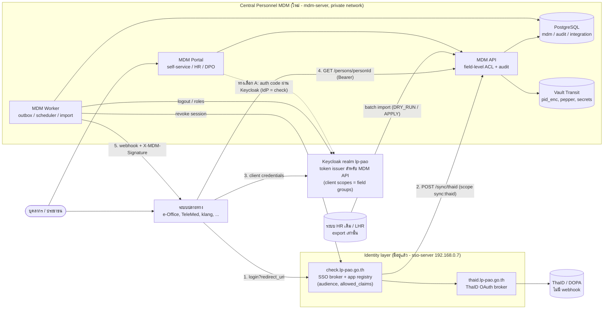
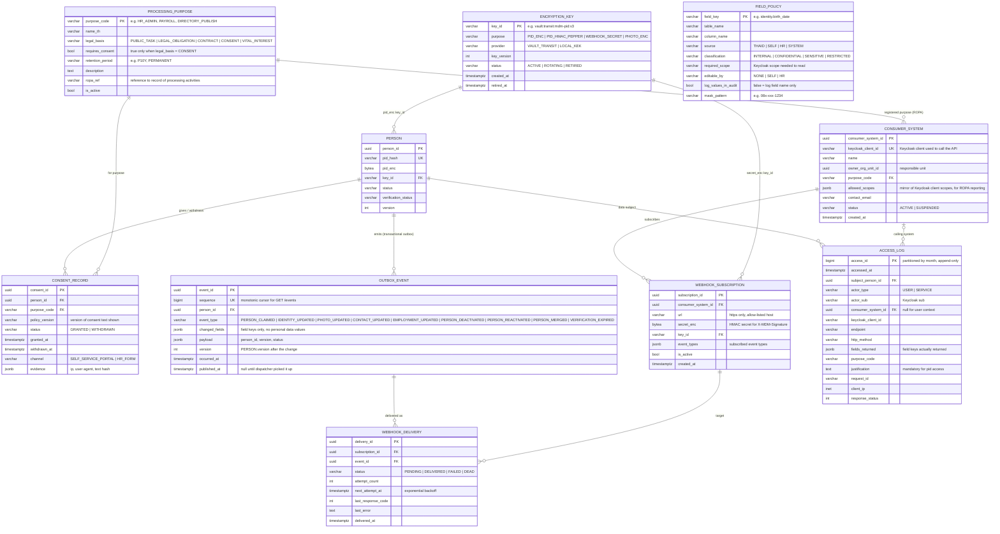
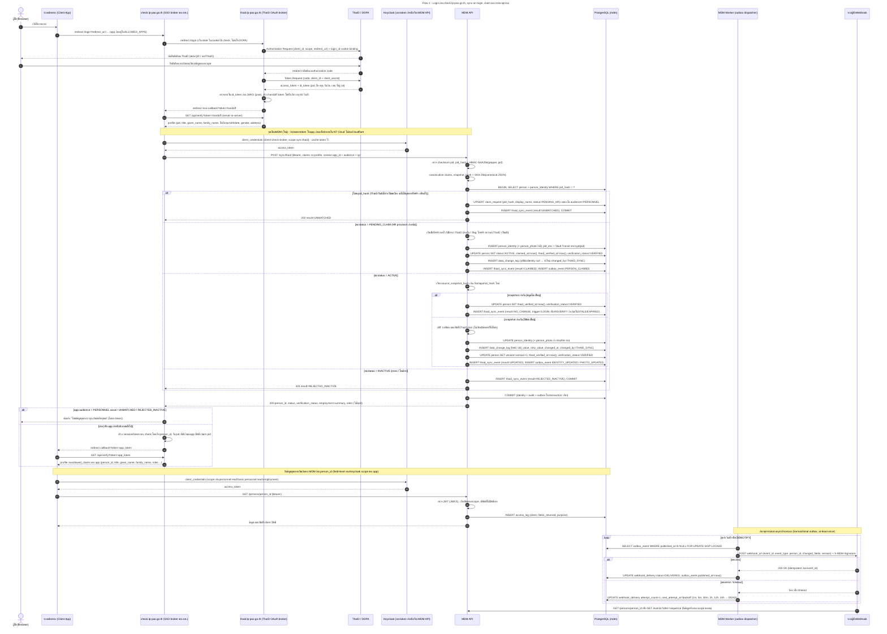
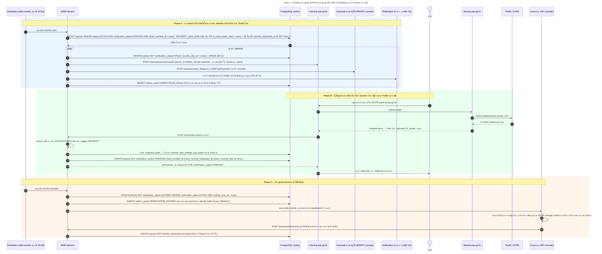

# เอกสารออกแบบสถาปัตยกรรม: ระบบฐานข้อมูลข้าราชการและพนักงานกลาง (Central Personnel Master Data System)

**หน่วยงาน:** องค์การบริหารส่วนจังหวัดลำปาง (อบจ.ลำปาง)
**จัดทำโดย:** กองยุทธศาสตร์และงบประมาณ
**เวอร์ชัน:** 1.0 (ร่างเพื่อทบทวน) — 13 กันยายน 2569
**สถานะเอกสาร:** Draft for review — ต้องผ่านการทบทวนโดยฝ่ายบุคคล (เจ้าของข้อมูล), เจ้าหน้าที่คุ้มครองข้อมูลส่วนบุคคล (DPO) และงานนิติการ ก่อนใช้จัดทำ TOR

ไฟล์ประกอบชุดนี้

| ไฟล์ | เนื้อหา |
|---|---|
| `personnel-mdm-design.md` | เอกสารฉบับนี้ (ข้อ 0–5 และภาคผนวก) |
| `personnel-mdm-openapi.yaml` | OpenAPI 3.1 ของ MDM API (ผ่านการตรวจสอบด้วย openapi-spec-validator) เปิดด้วย Swagger Editor / Redoc ได้ทันที |
| `arch-00-component-view.mermaid` | ภาพรวมองค์ประกอบระบบ (component view) |
| `er-01-personnel-core.mermaid` | ER Diagram 1/2 — ข้อมูลบุคลากรหลัก, ThaID sync, change log |
| `er-02-governance-integration.mermaid` | ER Diagram 2/2 — PDPA governance, access log, consumer systems, events/webhooks |
| `seq-01-thaid-login-sync.mermaid` | Sequence Diagram — login ผ่าน check.lp-pao.go.th และ sync-on-login |
| `seq-02-periodic-reverify.mermaid` | Sequence Diagram — re-verify เป็นระยะ |

---

## 0. ภาพรวมสถาปัตยกรรมและหลักการออกแบบ

### 0.1 บริบทและข้อจำกัดที่กำหนดทิศทางการออกแบบ

| ข้อจำกัด | ผลต่อการออกแบบ |
|---|---|
| ThaID/DOPA ไม่มี push API หรือ webhook ตรวจพบการเปลี่ยนแปลงได้เฉพาะตอนผู้ใช้ login | ใช้แนวทาง **sync-on-login + bounded staleness**: ทุก login คือโอกาส sync, และมีนโยบาย re-verify ที่บังคับให้ผู้ใช้ผ่าน ThaID ใหม่เมื่อข้อมูลเก่าเกินกำหนด ระบบต้องแสดง "อายุ" ของข้อมูล (`thaid_verified_at`, `verification_status`) ให้ระบบปลายทางตัดสินใจได้ |
| MDM **ไม่ติดต่อ DOPA โดยตรง** การยืนยันตัวตนทำผ่าน `thaid.lp-pao.go.th` (ThaID OAuth broker) และ `check.lp-pao.go.th` (SSO broker ของ อบจ. ที่มี app registry และ per-app allowed_claims อยู่แล้ว) | จุดเชื่อม MDM อยู่ที่ `check.lp-pao.go.th` เพียงจุดเดียว (server-side hook หลัง `/api/verify`) ระบบปลายทางที่เชื่อม check อยู่แล้วไม่ต้องเปลี่ยนวิธี login เพียงได้ `person_id` เพิ่มใน profile |
| ThaID ยืนยัน "พลเมือง" ไม่ได้ยืนยัน "การเป็นบุคลากรของ อบจ." | สถานะบุคลากรต้องมาจากฝ่ายบุคคลเท่านั้น (pre-provision → claim) การ login ThaID สำเร็จไม่ทำให้เกิด record บุคลากรโดยอัตโนมัติ และ check.lp-pao.go.th อาจให้บริการทั้งประชาชนและบุคลากร จึงต้องแยก `audience` ราย app |
| ข้อมูลแต่ละกลุ่มมีเจ้าของแหล่งข้อมูลต่างกัน (ThaID / เจ้าตัว / ฝ่ายบุคคล) | แยกตารางตามแหล่งข้อมูล (`person_identity`, `person_contact`, `employment`) และกำหนด `editable_by` รายฟิลด์ใน `field_policy` |
| Keycloak ใช้เป็น IAM อยู่แล้ว (Docker + PostgreSQL) | Keycloak เป็น **authorization server ของ MDM API** (client credentials + client scopes = กลุ่มฟิลด์) โดยไม่ต้องเปลี่ยนเส้นทาง login ของผู้ใช้ |
| โครงสร้างพื้นฐานปัจจุบัน: NT Cloud (VM `sso-server` 192.168.0.7 รัน thaid + check ผ่าน pm2/Redis, เผยแพร่ผ่าน Cloudflare Tunnel), Cloudflare Zero Trust Access, MinIO, Netdata/Uptime Kuma | MDM ติดตั้งบน VM ใหม่ใน subnet เดียวกัน; การเรียก API ระบบ↔ระบบ (รวม check → MDM) วิ่งใน private network ไม่ผ่าน Cloudflare; เผยแพร่เฉพาะ MDM Portal ผ่าน Tunnel + Zero Trust Access |

### 0.2 หลักการออกแบบ (Design Principles)

1. **Single Source of Truth แยกตามแหล่งข้อมูล** — ฟิลด์แต่ละกลุ่มมี system of record เดียว: ระบุตัวตน = ThaID, ติดต่อ = เจ้าตัว, ปฏิบัติงาน = ฝ่ายบุคคล ระบบอื่นเก็บได้เพียง cache ที่มี `version`
2. **Pseudonymous internal ID** — ทุกระบบอ้างอิงด้วย `person_id` (UUID) เลขบัตรประชาชนอยู่ใน MDM ในรูป `pid_hash` (HMAC) + `pid_enc` (เข้ารหัส) เท่านั้น การถอดรหัสเป็น endpoint แยกที่ต้องมี scope พิเศษและระบุเหตุผลทุกครั้ง
3. **Sync-on-login + periodic re-verify** — เปลี่ยนข้อจำกัดของ DOPA ให้เป็นนโยบายที่วัดได้ (`REVERIFY_MAX_AGE`, `GRACE`)
4. **Field-level authorization ผ่าน Keycloak scope** และ data minimization by default — ฟิลด์ที่ไม่มีสิทธิ์ถูกตัดออกจาก response ไม่ใช่ส่งเป็น null
5. **Transactional outbox → webhook + polling feed** — การเปลี่ยนข้อมูล, audit log และเหตุการณ์อยู่ใน transaction เดียว ส่งแบบ at-least-once, ผู้รับต้อง idempotent; payload ไม่มีค่าข้อมูลส่วนบุคคล
6. **Auditable by design** — `data_change_log` (เปลี่ยนอะไร จากอะไร เป็นอะไร เมื่อไหร่ โดยแหล่งใด) และ `access_log` (ใครอ่านฟิลด์ใดของใคร เพื่ออะไร) เป็น append-only
7. **Soft delete + immediate revoke** — พ้นสภาพแล้ว record ยังอยู่ตามอายุการเก็บเอกสาร แต่สิทธิ์ทุกระบบถูกเพิกถอนทันที
8. **Legal basis first, consent only where required** — งานบุคคลของหน่วยงานรัฐใช้ฐานหน้าที่ตามกฎหมาย/ภารกิจสาธารณะเป็นหลัก (พ.ร.บ.คุ้มครองข้อมูลส่วนบุคคล พ.ศ. 2562 มาตรา 24) ขอ consent เฉพาะวัตถุประสงค์เสริม (เช่น เผยแพร่รูป/เบอร์โทรในทำเนียบสาธารณะ)

### 0.3 องค์ประกอบระบบ (Component View)



| องค์ประกอบ | สถานะ | หน้าที่ | เทคโนโลยี |
|---|---|---|---|
| `thaid.lp-pao.go.th` — ThaID OAuth broker | มีอยู่แล้ว | คุยกับ DOPA (authorization code, ตรวจ id_token ด้วย JWKS, login_id cookie binding, circuit breaker) ออก handoff token ใช้ครั้งเดียว 60 วินาที ให้ check | Node.js/Express, pm2, Redis |
| `check.lp-pao.go.th` — SSO broker สำหรับระบบปลายทาง | มีอยู่แล้ว **(ต้องเพิ่ม hook, ดูข้อ 0.5)** | รับ handoff, เรียก `sso /api/verify`, ออก token ให้ app, กรอง claim ตาม `allowed_claims` ราย app, **เรียก `MDM POST /sync/thaid`** | Node.js/Express, pm2, Redis |
| Keycloak (realm `lp-pao`) | มีอยู่แล้ว | ออก access token สำหรับเรียก MDM API; client scopes = กลุ่มฟิลด์; (ทางเลือก A) broker check.lp-pao.go.th เป็น OIDC IdP สำหรับ MDM Portal/HR console | Keycloak + PostgreSQL |
| MDM API | ใหม่ | REST API ตาม OpenAPI, field-level filter, encryption service (Vault), audit middleware, rate limiting | Node.js (Express หรือ NestJS), `jose` สำหรับ JWT |
| MDM Worker | ใหม่ | outbox dispatcher (webhook + retry), scheduler (re-verify scan/escalate, retention), HR batch import, sync role → Keycloak | Node.js + `pg-boss` (คิวบน PostgreSQL ไม่ต้องเพิ่ม Redis) |
| MDM Portal | ใหม่ | self-service (ข้อมูลติดต่อ/ผู้ติดต่อฉุกเฉิน/consent/ดูประวัติการเปลี่ยนแปลงของตน), HR console (provision, claim request, employment, stale list), DPO console (access log) | Web app (Next.js/Vue หรือตาม convention ของทีม) เผยแพร่ผ่าน Cloudflare Tunnel + Zero Trust Access |
| PostgreSQL 16 | ใหม่ | schema `mdm` (master), `audit` (append-only, partitioned), `integration` (outbox/webhook) | PostgreSQL 16 |
| HashiCorp Vault (Transit + KV) | ใหม่ | เข้ารหัส/ถอดรหัส pid และรูปถ่าย (key ไม่ออกจาก Vault), เก็บ HMAC pepper, webhook secrets, key rotation | Vault (Docker) auto-unseal หรือ Shamir 3-of-5 |
| MinIO (ทางเลือก) | มีอยู่แล้ว | เก็บรูปถ่ายเป็น object พร้อม SSE หากไม่ต้องการเก็บ bytea ใน DB | MinIO |
| Netdata / Uptime Kuma | มีอยู่แล้ว | monitoring: outbox backlog, webhook DEAD, Vault seal status, sync error rate | ตามที่ใช้อยู่ |

**การตัดสินใจเรื่อง Keycloak (สำคัญ):** Keycloak ทำหน้าที่ *authorization server ของ MDM API* เป็นหลัก การ login ของผู้ใช้ยังคงเป็น `app → check → thaid.lp-pao.go.th → DOPA` ตามที่ใช้งานอยู่ ทำให้ระบบที่เชื่อม check แล้วไม่ต้องเปลี่ยนอะไรฝั่ง login สำหรับ *user context* (self-service, HR console) มี 2 ทางเลือก

| ทางเลือก | วิธีการ | ข้อดี | ข้อเสีย |
|---|---|---|---|
| **A (เป้าหมาย)** | `check.lp-pao.go.th` เพิ่ม OIDC Provider facade (`/.well-known/openid-configuration`, `/oidc/authorize`, `/oidc/token`, `/oidc/userinfo`, `/oidc/jwks`) ด้วย `oidc-provider` (panva) แล้วตั้งเป็น Identity Provider ใน Keycloak; `sub = person_id` | user token จาก Keycloak มี role/scope มาตรฐาน, ระบบใหม่เลือกใช้ Keycloak ได้โดยไม่กระทบระบบที่ใช้ check โดยตรง | งานเพิ่มฝั่ง check (ประมาณ 1–2 สัปดาห์) |
| **B (ชั่วคราว)** | MDM Portal เป็น app ของ check ตามปกติ; backend ของ Portal ถือ Keycloak client `mdm-portal` และส่ง acting user เป็น signed assertion (`X-Acting-Person`, JWT อายุสั้นที่ Portal ลงนาม) MDM ตรวจว่า self-service ทำกับ record ของตนเองเท่านั้น | ทำได้ทันที | สิทธิ์ HR/DPO ต้อง map ใน MDM เอง แทนที่จะอยู่ใน Keycloak; มี trusted component เพิ่ม |

ข้อกำหนดข้อ 5 (field-level ผ่าน Keycloak) ถูกครอบคลุมเต็มรูปแบบตั้งแต่ทางเลือก B แล้วสำหรับการเรียกแบบระบบ↔ระบบ ซึ่งเป็นผู้ใช้หลักของ API

### 0.4 เมทริกซ์เจ้าของข้อมูล (Data Ownership Matrix)

| กลุ่มข้อมูล | ฟิลด์หลัก | แหล่ง (system of record) | ผู้แก้ไข | ชั้นความลับ | scope ที่ต้องใช้อ่าน |
|---|---|---|---|---|---|
| ระบุตัวตน (`person_identity`) | คำนำหน้า ชื่อ สกุล (ไทย/อังกฤษ), วันเกิด, เพศ, ที่อยู่ตามทะเบียนบ้าน, วันออก/หมดอายุบัตร, IAL | ThaID (ผ่าน thaid.lp-pao.go.th → check) | ไม่มี (อัปเดตอัตโนมัติจาก ThaID เท่านั้น) | CONFIDENTIAL (ชื่อ = INTERNAL) | ชื่อ: `personnel:read:basic`; ที่เหลือ: `personnel:read:identity` |
| รูปถ่าย (`person_photo`) | รูปจากบัตร | ThaID (ต้องขอ scope จาก DOPA เพิ่ม; ถ้าไม่ได้ ใช้รูปจาก HR โดยตั้ง `source = HR`) | ไม่มี | CONFIDENTIAL | `personnel:read:photo` |
| เลขบัตรประชาชน (`person.pid_*`) | pid (hash + encrypted) | ThaID (HR ป้อนตอน provision เพื่อรอ claim) | ไม่มี | RESTRICTED | `personnel:read:pid` (endpoint แยก) |
| ติดต่อ (`person_contact`, `emergency_contact`) | มือถือ, อีเมลส่วนตัว, LINE, ที่อยู่ปัจจุบัน, ผู้ติดต่อฉุกเฉิน | เจ้าของข้อมูล | เจ้าตัว (HR แก้แทนได้พร้อมบันทึกเหตุผล) | CONFIDENTIAL | `personnel:read:contact` |
| ปฏิบัติงาน (`employment`) | เลขประจำตัว, ประเภทบุคลากร, ตำแหน่ง/เลขที่ตำแหน่ง, สังกัด, ระดับ, วันบรรจุ, สถานะ, อีเมลหน่วยงาน | ฝ่ายบุคคล (ระบบ HR เดิม → ภายหลัง MDM console) | HR เท่านั้น | INTERNAL (ตำแหน่ง/สังกัด) / CONFIDENTIAL (วันบรรจุ, เหตุพ้นสภาพ) | `personnel:read:basic` / `personnel:read:employment` |
| สถานะระบบ (`person.status`, `verification_status`) | ACTIVE/INACTIVE, VERIFIED/STALE/EXPIRED | MDM | ระบบ / HR | INTERNAL | `personnel:read:basic` |

ข้อมูลที่ **ไม่เก็บโดยเจตนา** แม้ DOPA จะส่งมา: ศาสนา, หมู่โลหิต (ข้อมูลอ่อนไหวตามมาตรา 26) — ตัดทิ้งที่ thaid/check ก่อนถึง MDM และ schema ไม่มีคอลัมน์รองรับ

### 0.5 สิ่งที่ต้องเพิ่มใน `check.lp-pao.go.th` (สัญญาการเชื่อมต่อกับ MDM)

check.lp-pao.go.th เป็นจุดเดียวที่เห็นทั้ง profile จาก ThaID และ app ที่ผู้ใช้กำลังจะเข้า จึงเป็นที่ที่เหมาะกับการ sync

| # | สิ่งที่ต้องทำ | รายละเอียด |
|---|---|---|
| 1 | เพิ่มคุณสมบัติใน app registry (`ALLOWED_APPS`) | `audience: PERSONNEL \| CITIZEN \| BOTH`, `allowed_claims` ค่าเริ่มต้นของ app บุคลากร = `person_id, title, given_name, family_name, roles` (**ไม่มี pid**) การให้ claim `pid` ต้องได้รับอนุมัติจาก DPO และบันทึกเหตุผลใน registry |
| 2 | Hook ใน handler `/sso-callback` | หลังได้ profile จาก `GET thaid.lp-pao.go.th/api/verify?token=` และก่อนสร้าง session/token ให้ app: เรียก `POST https://mdm.<private>/api/v1/sync/thaid` ด้วย Keycloak client credentials (client `check-broker`, scope `sync:thaid`, cache token จนใกล้หมดอายุ) timeout 3 วินาที ผ่าน private network ของ NT Cloud |
| 3 | นโยบายเมื่อผล sync = `UNMATCHED` / `REJECTED_INACTIVE` | app `PERSONNEL` → แสดงหน้าปฏิเสธ ไม่ออก token; app `CITIZEN`/`BOTH` → ผ่านได้โดยไม่มี `person_id` |
| 4 | โหมดการทำงาน `MDM_SYNC_MODE` | `off` (ไม่เรียก MDM), `shadow` (เรียกและบันทึกผล แต่ไม่เคยปฏิเสธ — ใช้ช่วง migrate), `enforce` (บังคับตามข้อ 3) เปลี่ยนได้โดยไม่ต้อง deploy |
| 5 | Graceful degradation เมื่อ MDM ล่ม | ใช้ cache ใน Redis `pid_hash → {person_id, status}` อายุ 7 วัน (เขียนทุกครั้งที่ sync สำเร็จ) ออก token พร้อม claim `verification = CACHED`; ถ้าไม่มี cache และ app เป็น `PERSONNEL` → ปฏิเสธพร้อมข้อความชั่วคราว; แจ้งเตือน Uptime Kuma |
| 6 | Session และ `/api/verify` ของ check | เก็บ `person_id`, `personnel_status`, `roles` ใน session; **ทิ้ง pid ทันที** เว้นแต่ app ที่ปลายทางมีสิทธิ์ claim `pid`; เพิ่ม `person_id`, `personnel_status`, `roles` เป็น claim ที่ app ขอได้ |
| 7 | Endpoint ภายในใหม่ `POST /internal/sessions/revoke` | body `{ person_id }` ลบทุก session ของบุคคลใน Redis (ต้องมี index `person_id → session ids`) ป้องกันด้วย private network + HMAC shared secret ในลักษณะเดียวกับ `/internal/verify` ที่มีอยู่ ใช้โดย MDM worker ตอน deactivate และ re-verify |
| 8 | Logging | คง discipline เดิม: ไม่มี pid ใน log/URL; log `person_id` แทน |
| 9 | (ทางเลือก A) OIDC Provider facade | สำหรับให้ Keycloak broker ดูข้อ 0.3 |

ฝั่ง `thaid.lp-pao.go.th` ไม่ต้องเปลี่ยนตรรกะ ยกเว้น (ก) ขอ scope เพิ่มจาก DOPA หากต้องการรูปถ่ายและ IAL และ (ข) ส่งต่อ claim เหล่านั้นใน `/api/verify` เพิ่มเติม

---

## 1. Entity-Relationship Diagram และคำอธิบายตาราง

### 1.1 การจัดวาง schema

| schema | ตาราง | หมายเหตุ |
|---|---|---|
| `mdm` | person, person_identity, person_photo, person_contact, emergency_contact, employment, org_unit, position, external_identifier, claim_request, processing_purpose, consent_record, consumer_system, field_policy, encryption_key | ข้อมูลหลัก application role มีสิทธิ์ SELECT/INSERT/UPDATE ไม่มี DELETE (soft delete เท่านั้น) |
| `audit` | thaid_sync_event, data_change_log, access_log | **append-only**: REVOKE UPDATE/DELETE จากทุก role + trigger ป้องกัน; `access_log` partition รายเดือน; ส่งสำเนาไป log server ภายนอกด้วย |
| `integration` | outbox_event, webhook_subscription, webhook_delivery | worker role มีสิทธิ์ UPDATE เฉพาะ `published_at`, `webhook_delivery` |

### 1.2 ER Diagram 1/2 — ข้อมูลบุคลากรหลัก, ThaID sync และ change log

```mermaid
erDiagram
    %% ================================================================
    %% ER 1/2 : Personnel core data, ThaID sync and field-level audit
    %% Source of each table  THAID = ThaID only | SELF = owner edits | HR = HR/legacy HR system
    %% ================================================================

    PERSON ||--o| PERSON_IDENTITY : "identity (THAID, read-only)"
    PERSON ||--o{ PERSON_PHOTO : "photo (THAID)"
    PERSON ||--o| PERSON_CONTACT : "contact (SELF)"
    PERSON ||--o{ EMERGENCY_CONTACT : "emergency (SELF)"
    PERSON ||--o{ EMPLOYMENT : "employment history (HR)"
    ORG_UNIT ||--o{ EMPLOYMENT : "assigned to"
    ORG_UNIT |o--o{ ORG_UNIT : "parent of"
    POSITION ||--o{ EMPLOYMENT : "holds position"
    ORG_UNIT ||--o{ POSITION : "position belongs to"
    PERSON ||--o{ EXTERNAL_IDENTIFIER : "id in other systems"
    PERSON |o--o{ THAID_SYNC_EVENT : "sync history"
    PERSON ||--o{ DATA_CHANGE_LOG : "field-level audit"
    THAID_SYNC_EVENT |o--o{ DATA_CHANGE_LOG : "produced by"
    PERSON |o--o{ CLAIM_REQUEST : "resolved to"

    PERSON {
        uuid person_id PK "internal ID used by all other systems"
        varchar pid_hash UK "HMAC-SHA256(pepper, pid) for lookup and dedup"
        bytea pid_enc "AES-256-GCM via Vault Transit, decrypt only with scope personnel:read:pid"
        varchar key_id FK "encryption key version"
        varchar status "PENDING_CLAIM | ACTIVE | INACTIVE"
        varchar verification_status "UNVERIFIED | VERIFIED | STALE | EXPIRED"
        timestamptz thaid_verified_at "last successful ThaID login"
        timestamptz claimed_at "first ThaID login that claimed the record"
        timestamptz reverify_requested_at "HR-triggered re-verify"
        timestamptz reverify_due_at "STALE becomes EXPIRED after this"
        varchar expected_first_name_th "name given by HR at provision, checked at claim"
        varchar expected_last_name_th
        timestamptz deleted_at "soft delete on separation"
        int version "increments on every change, sent in events"
        timestamptz created_at
        timestamptz updated_at
    }

    PERSON_IDENTITY {
        uuid person_id PK "FK to PERSON, 1:1"
        varchar title_th
        varchar first_name_th
        varchar middle_name_th
        varchar last_name_th
        varchar title_en
        varchar first_name_en
        varchar last_name_en
        date birth_date
        varchar gender
        varchar reg_house_no "registered address (ที่อยู่ตามทะเบียนบ้าน)"
        varchar reg_moo
        varchar reg_soi
        varchar reg_road
        varchar reg_subdistrict_code
        varchar reg_district_code
        varchar reg_province_code
        text reg_address_text "as received from ThaID"
        date id_card_issue_date
        date id_card_expire_date
        varchar ial "Identity Assurance Level from ThaID"
        varchar source_snapshot_hash "SHA-256 of canonical ThaID payload"
        uuid last_sync_event_id FK
        timestamptz synced_at
    }

    PERSON_PHOTO {
        uuid photo_id PK
        uuid person_id FK
        bytea image_enc "encrypted at rest (or MinIO object key with SSE)"
        varchar sha256 "change detection"
        varchar mime_type
        varchar source "THAID"
        bool is_current
        timestamptz synced_at
    }

    PERSON_CONTACT {
        uuid person_id PK "FK to PERSON, 1:1"
        varchar mobile_phone
        varchar phone_alt
        varchar email_personal
        varchar line_id
        bool same_as_registered
        text cur_address_text "current address"
        varchar cur_subdistrict_code
        varchar cur_district_code
        varchar cur_province_code
        varchar cur_postcode
        varchar updated_by "SELF | HR"
        timestamptz updated_at
    }

    EMERGENCY_CONTACT {
        uuid emergency_contact_id PK
        uuid person_id FK
        varchar full_name
        varchar relationship
        varchar phone
        int priority
        timestamptz updated_at
    }

    EMPLOYMENT {
        uuid employment_id PK
        uuid person_id FK
        varchar employee_no "เลขประจำตัวข้าราชการ/พนักงาน"
        varchar personnel_type "ข้าราชการ อบจ. | ลูกจ้างประจำ | พนักงานจ้าง | ถ่ายโอน"
        uuid position_id FK
        uuid org_unit_id FK
        varchar level_code "ปฏิบัติการ | ชำนาญการ | ..."
        date appointed_date "วันบรรจุ"
        date effective_from
        date effective_to "null = current"
        bool is_current
        varchar employment_status "ACTIVE | TRANSFERRED_OUT | RESIGNED | RETIRED | TERMINATED | DECEASED"
        date separation_date
        varchar separation_reason
        varchar email_work "provisioned by IT"
        varchar hr_source_ref "record id in legacy HR / LHR"
        varchar updated_by "HR user or HR_IMPORT"
        timestamptz updated_at
    }

    ORG_UNIT {
        uuid org_unit_id PK
        uuid parent_id FK
        varchar code UK
        varchar name_th
        varchar name_en
        varchar unit_level "สำนัก/กอง | ฝ่าย | งาน"
        bool is_active
        date valid_from
        date valid_to
    }

    POSITION {
        uuid position_id PK
        varchar position_no UK "เลขที่ตำแหน่ง"
        varchar title_th "ชื่อตำแหน่ง"
        varchar line_of_work "สายงาน"
        varchar position_type "บริหารท้องถิ่น | อำนวยการท้องถิ่น | วิชาการ | ทั่วไป"
        uuid org_unit_id FK
        bool is_active
    }

    EXTERNAL_IDENTIFIER {
        uuid ext_id PK
        uuid person_id FK
        varchar system_code "LEGACY_HR | LHR | KEYCLOAK | PAYROLL | EOFFICE"
        varchar external_value "unique per system_code"
        bool is_primary
        timestamptz created_at
    }

    THAID_SYNC_EVENT {
        uuid sync_event_id PK
        uuid person_id FK "null when UNMATCHED"
        varchar trigger "LOGIN | REVERIFY | CLAIM"
        varchar result "NO_CHANGE | UPDATED | CLAIMED | UNMATCHED | REJECTED_INACTIVE"
        varchar app_id "app ที่ผู้ใช้ล็อกอินผ่าน check.lp-pao.go.th"
        varchar audience "PERSONNEL | CITIZEN (จาก app registry ของ check)"
        varchar snapshot_hash_before
        varchar snapshot_hash_after
        jsonb changed_fields "field keys only"
        varchar ial
        varchar aal
        inet client_ip
        varchar user_agent
        timestamptz occurred_at
    }

    DATA_CHANGE_LOG {
        bigint log_id PK
        uuid person_id FK
        uuid sync_event_id FK "null if not from ThaID"
        varchar table_name
        varchar field_name
        jsonb old_value "encrypted when field classification is RESTRICTED"
        jsonb new_value
        varchar changed_by "THAID_SYNC | SELF | HR | HR_IMPORT | ADMIN"
        varchar actor_sub "Keycloak sub / client id"
        varchar reason
        timestamptz changed_at
    }

    CLAIM_REQUEST {
        uuid claim_request_id PK
        varchar pid_hash "no plaintext pid stored"
        varchar display_name "from ThaID, for HR to identify"
        varchar status "PENDING_HR | LINKED | REJECTED"
        uuid resolved_person_id FK
        varchar resolved_by
        timestamptz resolved_at
        int attempt_count
        timestamptz first_seen_at
        timestamptz last_seen_at
    }
```



### 1.3 ER Diagram 2/2 — PDPA governance, access log, consumer systems และ events



### 1.4 คำอธิบายตาราง

**กลุ่มบุคลากรหลัก**

| ตาราง | หน้าที่ | คอลัมน์สำคัญ / กฎ |
|---|---|---|
| `person` | ตัวตนภายในของบุคลากรหนึ่งคน เป็น anchor ของทุกความสัมพันธ์ | `person_id` UUID ที่ทุกระบบใช้; `pid_hash` UNIQUE (HMAC-SHA256 ด้วย pepper ใน Vault) ใช้ค้นหา/กันซ้ำ; `pid_enc` (Vault Transit AES-256-GCM, `key_id` บอกเวอร์ชันคีย์); `status` PENDING_CLAIM → ACTIVE → INACTIVE; `verification_status`; `thaid_verified_at`; `deleted_at` (soft delete); `version` เพิ่มทุกครั้งที่ข้อมูลกลุ่มใดเปลี่ยน ใช้เป็น ETag และใส่ในเหตุการณ์ |
| `person_identity` | ข้อมูลระบุตัวตนจาก ThaID **อ่านอย่างเดียว** 1:1 กับ person | ชื่อ-สกุลไทย/อังกฤษ, วันเกิด, เพศ, ที่อยู่ตามทะเบียนบ้าน (แยกองค์ประกอบ + ข้อความเต็มตามที่ได้รับ), วันออก/หมดอายุบัตร, `ial`, `source_snapshot_hash` (SHA-256 ของ payload แบบ canonical ใช้ตรวจการเปลี่ยนแปลงแบบ O(1)), `last_sync_event_id` |
| `person_photo` | รูปถ่ายจาก ThaID (เก็บหลายเวอร์ชัน, `is_current` เพียงหนึ่ง) | `image_enc` เข้ารหัส (หรือ object key ใน MinIO), `sha256` ใช้ตรวจว่ารูปเปลี่ยน |
| `person_contact` | ข้อมูลติดต่อที่เจ้าตัวแก้ไขเอง 1:1 | มือถือ, อีเมลส่วนตัว, LINE, ที่อยู่ปัจจุบัน, `same_as_registered`; `updated_by` SELF/HR |
| `emergency_contact` | ผู้ติดต่อฉุกเฉิน 1:N (สูงสุด 3) | ชื่อ, ความสัมพันธ์, โทร, ลำดับ (ข้อมูลของบุคคลที่สาม — เก็บเท่าที่จำเป็น) |
| `employment` | ข้อมูลการปฏิบัติงานจากฝ่ายบุคคล เก็บเป็นประวัติ (1:N) | `employee_no`, `personnel_type`, `position_id`, `org_unit_id`, `level_code`, `appointed_date` (วันบรรจุ), `effective_from/to`, `is_current` (partial unique index: หนึ่ง current ต่อ person), `employment_status`, `separation_*`, `email_work`, `hr_source_ref` (รหัสในระบบ HR เดิม/LHR) |
| `org_unit` | โครงสร้างส่วนราชการแบบลำดับชั้น สำนัก/กอง → ฝ่าย → งาน | `parent_id`, `code` UNIQUE, `valid_from/to` รองรับการปรับโครงสร้าง |
| `position` | กรอบอัตรากำลัง/เลขที่ตำแหน่ง | `position_no` UNIQUE, ชื่อตำแหน่ง, สายงาน, ประเภท (บริหารท้องถิ่น/อำนวยการท้องถิ่น/วิชาการ/ทั่วไป), `org_unit_id`; กฎ: ตำแหน่งหนึ่งมีผู้ครองได้หนึ่งคนในช่วงเวลาหนึ่ง (EXCLUDE constraint บนช่วง `effective_from/to` ของ employment) |
| `external_identifier` | รหัสของบุคคลเดียวกันในระบบอื่น | `system_code` (LEGACY_HR, LHR, KEYCLOAK, PAYROLL, EOFFICE ...), `external_value`; UNIQUE(system_code, external_value) ใช้ตอน migrate และตอน merge |
| `claim_request` | การ login ThaID ที่ไม่ตรงกับบุคลากรใด (เฉพาะ app audience=PERSONNEL) รอ HR ตัดสิน | เก็บเฉพาะ `pid_hash` + ชื่อที่แสดง (ไม่มี pid ตัวจริง), `attempt_count`, `status` PENDING_HR/LINKED/REJECTED, `resolved_person_id` |

**กลุ่ม audit**

| ตาราง | หน้าที่ | คอลัมน์สำคัญ / กฎ |
|---|---|---|
| `thaid_sync_event` | บันทึกทุกครั้งที่มีการ sync จาก ThaID (ผ่าน check) | `trigger` LOGIN/REVERIFY/CLAIM, `result` NO_CHANGE/UPDATED/CLAIMED/UNMATCHED/REJECTED_INACTIVE, `snapshot_hash_before/after`, `changed_fields` (ชื่อฟิลด์เท่านั้น), `ial/aal`, `app_id`, `audience`, ip, user agent |
| `data_change_log` | **ฟิลด์ใด เปลี่ยนจากอะไร เป็นอะไร เมื่อไหร่ โดยใคร/แหล่งใด** ครอบคลุมทุกตารางข้อมูลบุคคล | `table_name`, `field_name`, `old_value/new_value` (JSONB; ฟิลด์ที่ `field_policy.log_values_in_audit = false` เช่น pid จะบันทึกเฉพาะชื่อฟิลด์), `changed_by` THAID_SYNC/SELF/HR/HR_IMPORT/ADMIN, `actor_sub`, `sync_event_id`, `reason` |
| `access_log` | ใครอ่านฟิลด์ใดของใคร ผ่าน client ใด เพื่อวัตถุประสงค์ใด (PDPA audit trail) | `subject_person_id`, `actor_type/sub`, `keycloak_client_id`, `endpoint`, `fields_returned` (ชื่อฟิลด์ที่ส่งจริงหลังกรอง), `purpose_code`, `justification` (บังคับสำหรับ pid), `request_id`; partition รายเดือน |

**กลุ่ม governance และ integration**

| ตาราง | หน้าที่ | คอลัมน์สำคัญ / กฎ |
|---|---|---|
| `processing_purpose` | ทะเบียนวัตถุประสงค์การประมวลผลและ**ฐานทางกฎหมาย** ใช้สร้างบันทึกรายการประมวลผล (ROPA, มาตรา 39) | `legal_basis` PUBLIC_TASK/LEGAL_OBLIGATION/CONTRACT/CONSENT/VITAL_INTEREST, `requires_consent` (true เฉพาะ CONSENT), `retention_period` |
| `consent_record` | ความยินยอมรายวัตถุประสงค์ (เฉพาะที่ใช้ฐาน consent) พร้อมหลักฐาน | `policy_version`, `status` GRANTED/WITHDRAWN, `granted_at/withdrawn_at`, `channel`, `evidence` |
| `consumer_system` | ทะเบียนระบบปลายทางที่เรียก MDM | `keycloak_client_id` UNIQUE, หน่วยงานเจ้าของ, `purpose_code`, `allowed_scopes` (mirror ของ Keycloak เพื่อรายงาน ROPA), สถานะ |
| `field_policy` | แคตตาล็อกฟิลด์: แหล่ง, ชั้นความลับ, scope ที่ต้องใช้, ใครแก้ได้, บันทึกค่าใน audit หรือไม่, รูปแบบ mask | เป็นตัวขับเคลื่อน field-level filter และหน้า self-service (ฟิลด์ที่ `editable_by = NONE` แสดงเป็น read-only พร้อมป้าย "จาก ThaID") |
| `encryption_key` | ทะเบียนเวอร์ชันคีย์ (คีย์จริงอยู่ใน Vault) | `key_id`, `purpose`, `key_version`, `status` ACTIVE/ROTATING/RETIRED |
| `outbox_event` | เหตุการณ์ที่ต้องส่งออก เขียนใน transaction เดียวกับการเปลี่ยนข้อมูล | `sequence` (bigserial, cursor ของ `GET /events`), `event_type`, `changed_fields` (ชื่อฟิลด์), `payload` ขั้นต่ำ (status, version), `published_at` |
| `webhook_subscription` | การสมัครรับเหตุการณ์ของแต่ละ consumer | `url` (https, host อยู่ใน allow-list), `secret_enc`, `event_types` |
| `webhook_delivery` | ความพยายามส่งแต่ละครั้ง | `status` PENDING/DELIVERED/FAILED/DEAD, `attempt_count`, `next_attempt_at` (backoff), `last_response_code` |

### 1.5 ความสัมพันธ์ (Cardinality)

- `person` 1 — 0..1 `person_identity` (ยังไม่ claim = ยังไม่มี identity), 1 — 0..N `person_photo` (current หนึ่งรูป), 1 — 0..1 `person_contact`, 1 — 0..3 `emergency_contact`
- `person` 1 — 0..N `employment` (ประวัติ) ; `employment` N — 1 `org_unit`, N — 1 `position` ; `org_unit` self-reference (parent) ; `position` N — 1 `org_unit`
- `person` 1 — 0..N `external_identifier`, `thaid_sync_event`, `data_change_log`, `access_log` (subject), `consent_record`, `outbox_event`
- `thaid_sync_event` 1 — 0..N `data_change_log` (การ sync หนึ่งครั้งอาจเปลี่ยนหลายฟิลด์)
- `claim_request` N — 0..1 `person` (เมื่อ HR เชื่อมแล้ว)
- `processing_purpose` 1 — N `consent_record`, 1 — N `consumer_system` ; `consumer_system` 1 — N `webhook_subscription`, 0..N `access_log` (actor)
- `outbox_event` 1 — N `webhook_delivery` (หนึ่งเหตุการณ์ส่งหลายผู้รับ) ; `webhook_subscription` 1 — N `webhook_delivery`
- `encryption_key` 1 — N `person` (pid_enc), 1 — N `webhook_subscription` (secret_enc)

### 1.6 ข้อกำหนดระดับ schema ที่ต้องมี

| ประเด็น | ข้อกำหนด |
|---|---|
| กันข้อมูลซ้ำ | `UNIQUE (pid_hash)`; ตรวจ checksum เลขบัตร (mod 11) ที่ API ก่อน hash; `UNIQUE (employee_no) WHERE is_current`; `EXCLUDE USING gist (position_id WITH =, daterange(effective_from, effective_to) WITH &&) WHERE (employment_status = 'ACTIVE')` |
| Soft delete | `person.deleted_at` + `status = INACTIVE`; view `person_active` สำหรับ API ทั่วไป; record INACTIVE อ่านได้เฉพาะ scope `personnel:read:inactive` |
| Append-only audit | `REVOKE UPDATE, DELETE ON audit.* FROM app_role`; trigger `RAISE EXCEPTION` บน UPDATE/DELETE; `access_log` partition รายเดือน (`PARTITION BY RANGE (accessed_at)`), archive partition เก่าไป object storage ตามอายุการเก็บ |
| Optimistic locking | `person.version` ตรวจกับ `expectedVersion` ใน request ของ HR |
| การเข้ารหัส | ไม่ใช้ `pgcrypto` กับ pid (คีย์จะอยู่ใน SQL log); ใช้ Vault Transit จาก application layer; `pid_enc` เก็บ ciphertext รูปแบบ `vault:vN:...` |
| ดัชนี | `person(pid_hash)`, `person(status, verification_status)`, `person(thaid_verified_at)`, `employment(person_id) WHERE is_current`, `employment(org_unit_id, is_current)`, `outbox_event(published_at) WHERE published_at IS NULL`, `webhook_delivery(next_attempt_at) WHERE status IN ('PENDING','FAILED')`, `access_log(subject_person_id, accessed_at)` |
| Role ใน DB | `mdm_app` (API), `mdm_worker`, `mdm_readonly` (รายงาน — ไม่เห็น `pid_enc` ผ่าน column privilege), `mdm_audit` (อ่าน audit เท่านั้น); ไม่มี superuser ใน connection string ของ app |

---

## 2. OpenAPI Specification

ไฟล์ `personnel-mdm-openapi.yaml` (OpenAPI 3.1, ผ่านการตรวจสอบโครงสร้างแล้ว) ประกอบด้วย 31 path และ 30 schema สรุปสาระสำคัญดังนี้

### 2.1 สรุป endpoint

| กลุ่ม | Endpoint | scope | ใช้โดย |
|---|---|---|---|
| Persons | `GET /persons` (ค้นหา, filter สังกัด/ตำแหน่ง/สถานะ/`updatedSince`, cursor pagination) | `personnel:read:basic` (+scope กลุ่มฟิลด์อื่น) | ระบบปลายทาง |
| | `GET /persons/{personId}` (รองรับ `fields=` และ ETag/304) | `personnel:read:basic` (+) | ระบบปลายทาง |
| | `GET /persons/{personId}/photo` | `personnel:read:photo` | ระบบปลายทาง |
| | `GET /persons/{personId}/pid?justification=` (endpoint แยก, no-store, audit แยก) | `personnel:read:pid` | ระบบที่มีฐานกฎหมายต้องใช้ pid เท่านั้น |
| | `POST /persons/lookup` (pid → personId, rate limit, 404 แบบเดียวกันทุกกรณี) | `personnel:lookup:pid` | ตอน migrate/เชื่อมครั้งแรก |
| Provisioning | `POST /persons` (pre-provision → PENDING_CLAIM), `GET /claim-requests`, `POST /claim-requests/{id}/resolve` (PROVISION/LINK/REJECT), `GET /reverify/stale` | `personnel:provision` | HR console |
| | `POST /persons/{id}/deactivate` (soft delete + revoke), `/reactivate`, `/reverify` | `personnel:write:employment` | HR console |
| Employment | `GET/PUT /persons/{id}/employment` (ประวัติ, optimistic lock) | `personnel:read:employment` / `personnel:write:employment` | ระบบปลายทาง / HR |
| Me | `GET /me`, `PUT /me/contact`, `PUT /me/emergency-contacts`, `POST /me/report-identity-issue`, `GET/PUT /me/consents` | `personnel:self` (user context) | MDM Portal |
| Sync | `POST /sync/thaid` (sync-on-login) | `sync:thaid` | **check.lp-pao.go.th เท่านั้น** |
| | `POST /sync/hr/employment-batch` (DRY_RUN/APPLY, รายงาน error รายแถว) | `personnel:import` | HR / งาน migrate |
| Events | `GET /events?after=&eventType=` (pull feed, เก็บ ≥ 90 วัน) | `events:read` | ระบบที่รับ webhook ไม่ได้ หรือใช้ reconcile |
| Webhooks | `GET/POST /webhooks/subscriptions`, `DELETE .../{id}`, `POST .../{id}/test`, `GET /webhooks/deliveries`, `POST .../{id}/retry` | `webhook:manage` | ระบบปลายทาง |
| Reference | `GET /org-units`, `GET /positions` | `personnel:read:basic` | ทุกระบบ |
| Audit | `GET /persons/{id}/change-log`, `GET /audit/access-logs` | `audit:read` | DPO / ผู้ตรวจสอบ |
| System | `GET /health` | — | monitoring |

### 2.2 การควบคุมสิทธิ์ระดับฟิลด์ผ่าน Keycloak

**หลักการ:** Keycloak client scope = กลุ่มฟิลด์ (field group) การอนุมัติ scope ให้ client ใดคือการอนุมัติการเข้าถึงข้อมูลกลุ่มนั้น ซึ่งต้องผูกกับ `consumer_system.purpose_code` (ROPA) และผ่านการเห็นชอบของ DPO

| Keycloak client scope | ฟิลด์ที่ปลดล็อก | หมายเหตุ |
|---|---|---|
| `personnel:read:basic` | personId, ชื่อ-สกุล (ไทย/อังกฤษ), ประเภทบุคลากร, ตำแหน่ง/เลขที่ตำแหน่ง, ระดับ, สังกัด, อีเมลหน่วยงาน, status, verificationStatus, version | scope ขั้นต่ำของทุก consumer (ไม่รวม employeeNo อีกต่อไป - ดูแถว personnel:read:pid) |
| `personnel:read:contact` | มือถือ, อีเมลส่วนตัว, LINE, ที่อยู่ปัจจุบัน, ผู้ติดต่อฉุกเฉิน | เช่น ระบบสารบรรณที่ต้องส่ง SMS |
| `personnel:read:identity` | วันเกิด, เพศ, ที่อยู่ตามทะเบียนบ้าน, วันออก/หมดอายุบัตร, IAL, syncedAt | เช่น ระบบสวัสดิการ |
| `personnel:read:employment` | วันบรรจุ, ประวัติการดำรงตำแหน่ง, เหตุ/วันพ้นสภาพ | เช่น ระบบประเมินผล, ระบบเงินเดือน |
| `personnel:read:photo` | รูปถ่าย | เช่น ระบบบัตรพนักงาน |
| `personnel:read:inactive` | เห็น record INACTIVE | ระบบเงินเดือน/บำเหน็จ |
| `personnel:read:pid` / `personnel:lookup:pid` | ถอดรหัส pid / ค้นจาก pid / employeeNo (= pid เสมอ - อบจ.ลำปางไม่มีเลขประจำตัวข้าราชการแยกต่างหาก) | อนุมัติเป็นราย client โดย DPO เท่านั้น |
| `personnel:self` | ข้อมูลของตนเอง + แก้ไขข้อมูลติดต่อ/ความยินยอม | user context |
| `personnel:provision`, `personnel:write:employment`, `personnel:import` | งาน HR | realm role `hr_officer` |
| `sync:thaid` | `POST /sync/thaid` | client `check-broker` เท่านั้น |
| `events:read`, `webhook:manage` | ฟีดเหตุการณ์ / webhook | ระบบปลายทาง |
| `audit:read` | change log, access log | realm role `dpo`, `auditor` |

**กลไกบังคับใช้ใน MDM API (ทุก request):**

1. ตรวจ JWT ด้วย `jose`: `alg = RS256` เท่านั้น, `iss` = realm `lp-pao`, `aud` มี `mdm-api` (ตั้ง audience mapper ใน Keycloak), JWKS cache พร้อม rotation
2. อ่าน `scope` claim → สร้าง field mask จาก `field_policy` (ฟิลด์ที่ `required_scope` อยู่ในชุด scope ของ token)
3. ประมวลผล → response serializer ตัดฟิลด์นอก mask ออก (**ไม่ใส่ null** เพื่อไม่ให้ระบบปลายทางแยกไม่ออกระหว่าง "ไม่มีข้อมูล" กับ "ไม่มีสิทธิ์")
4. เขียน `access_log` พร้อม `fields_returned` ที่ส่งจริง และ `purpose_code` จาก `consumer_system` ของ `azp`
5. user context (scope `personnel:self`): เพิ่ม row-level check `target person_id = token.person_id`; HR (`hr_officer`) ไม่มี row-level จำกัดในเวอร์ชันแรก (ทางเลือก: จำกัดตามสังกัดด้วย attribute `hr_scope_org_units`)

**การตั้งค่าใน Keycloak (สรุป — รายละเอียดในภาคผนวก ก):** สร้าง client scopes ตามตารางโดยตั้ง "Include in token scope" = on; ผูก scope ให้ client แบบ *default* เฉพาะที่อนุมัติ; สำหรับ user scope ใช้แท็บ "Scope" ของ client scope เพื่อจำกัดให้เฉพาะผู้มี realm role ที่กำหนดได้รับ scope นั้น (เช่น `audit:read` เฉพาะ role `dpo`); client ระบบ↔ระบบเป็น confidential + service account; access token lifespan 5 นาที; ปิด refresh/offline token สำหรับ service account

### 2.3 สัญญา Webhook และ Event Feed

| หัวข้อ | ข้อกำหนด |
|---|---|
| Payload | `{ eventId, sequence, eventType, personId, occurredAt, version, changedFields[], data{status, verificationStatus, mergedIntoPersonId?} }` — **ไม่มีค่าข้อมูลส่วนบุคคล** ผู้รับดึงข้อมูลจริงผ่าน `GET /persons/{personId}` ตาม scope ของตน |
| Header | `X-MDM-Event-Id`, `X-MDM-Timestamp`, `X-MDM-Signature: sha256=HEX(HMAC-SHA256(secret, "<timestamp>.<raw body>"))`, `X-MDM-Delivery-Attempt` |
| การตรวจสอบฝั่งผู้รับ | ปฏิเสธถ้า timestamp ต่างจากเวลาปัจจุบันเกิน 5 นาที; เปรียบเทียบลายเซ็นแบบ constant-time; idempotent ด้วย `eventId`; ตอบ 2xx ภายใน 10 วินาที (ประมวลผลหนักให้เข้าคิวก่อนตอบ) |
| การส่งซ้ำ | at-least-once; backoff 1m → 5m → 30m → 2h → 12h → 24h → 24h แล้ว DEAD; DEAD ดู/สั่ง retry ได้ที่ `GET /webhooks/deliveries`, `POST .../retry` |
| ความปลอดภัย URL | https เท่านั้น; host ต้องอยู่ใน allow-list ของผู้ดูแล MDM; ห้าม redirect; timeout 10 วินาที; ป้องกัน SSRF (resolve DNS แล้วบล็อกช่วง private ยกเว้นที่ลงทะเบียน) |
| Secret | สร้างและแสดงครั้งเดียวตอนสมัคร; rotate ได้โดยสร้าง subscription ใหม่แล้วลบเก่า (ช่วง overlap) |
| Pull feed | `GET /events?after=<sequence>` เรียงตาม `sequence`; ผู้เรียกเก็บ `lastSequence`; ใช้เป็น fallback และ reconciliation รายวัน |

| Event type | เกิดเมื่อ | สิ่งที่ระบบปลายทาง**ต้อง**ทำ |
|---|---|---|
| `PERSON_CLAIMED` | บุคลากรเข้าสู่ระบบด้วย ThaID ครั้งแรก | สร้าง/เปิดใช้บัญชีในระบบตน (ถ้าเกี่ยวข้อง) |
| `IDENTITY_UPDATED` | ThaID ส่งข้อมูลระบุตัวตนต่างจากเดิม | ดึงข้อมูลใหม่, อัปเดตชื่อที่แสดง/ที่อยู่ที่ cache ไว้ |
| `PHOTO_UPDATED` | รูปเปลี่ยน | ดึงรูปใหม่ |
| `CONTACT_UPDATED` | เจ้าตัวแก้ข้อมูลติดต่อ | อัปเดต cache ถ้ามีสิทธิ์ contact |
| `EMPLOYMENT_UPDATED` | HR เปลี่ยนตำแหน่ง/สังกัด/สถานะ | ปรับสิทธิ์/กลุ่มผู้ใช้ตามสังกัดใหม่ |
| `PERSON_DEACTIVATED` | พ้นสภาพ/โอนย้ายออก | **เพิกถอนสิทธิ์ทันที ภายใน 15 นาที** (ปิดบัญชี, ตัด session) |
| `PERSON_REACTIVATED` | กลับเข้ารับราชการ/โอนย้ายกลับ | เปิดบัญชีใหม่ตามนโยบาย |
| `PERSON_MERGED` | HR รวม record ซ้ำ | ย้ายการอ้างอิงจาก `personId` เดิมไป `mergedIntoPersonId` |
| `VERIFICATION_STALE` / `VERIFICATION_EXPIRED` | ข้อมูล ThaID เก่าเกินกำหนด | แสดงป้าย "ข้อมูลรอยืนยัน"; ระบบที่ต้องการความถูกต้องสูง (เช่น ออกเอกสารทางการ) อาจบังคับให้ผู้ใช้ยืนยันก่อน |

### 2.4 มาตรฐาน API อื่น ๆ

- Versioning ใน path (`/api/v1`); breaking change = `/api/v2` และ deprecation header ล่วงหน้า 6 เดือน
- Error format RFC 9457 `application/problem+json` พร้อม `requestId` (ตรงกับ `access_log.request_id` เพื่อสืบสวน)
- `Idempotency-Key` สำหรับ POST/PUT ที่มีผลข้างเคียง (เก็บผล 24 ชั่วโมง)
- Rate limit ต่อ client (`429` + `Retry-After`); `POST /persons/lookup` และ `GET .../pid` มีลิมิตแยกที่ต่ำกว่ามาก
- Cursor pagination (ไม่ใช้ offset) `limit ≤ 200`
- ETag/If-None-Match บน `GET /persons/{id}` เพื่อให้ระบบปลายทาง poll ได้ถูก
- ไม่มี endpoint export ทั้งฐาน; รายงานสำหรับ HR ทำผ่าน Portal ด้วย scope HR และบันทึก access log ทุกครั้ง

---

## 3. Sequence Diagram การ sync ข้อมูลจาก ThaID

### 3.1 Flow 1 — login ผ่าน check.lp-pao.go.th, sync-on-login, claim และการส่งเหตุการณ์



**จุดสำคัญของ Flow 1**

| ขั้น | คำอธิบาย |
|---|---|
| 1–13 | เส้นทาง login เดิมทั้งหมด (app → check → thaid → DOPA → thaid → check) ไม่เปลี่ยน; thaid.lp-pao.go.th ยังคงเป็นผู้เดียวที่ถือ client credentials ของ DOPA และตรวจลายเซ็น id_token |
| 14–16 | **จุดเชื่อมใหม่**: check ถือ Keycloak token (client credentials, cache ไว้) แล้วเรียก `POST /sync/thaid` พร้อม profile และบริบท (`appId`, `audience`) ผ่าน private network |
| 17–19 | MDM ตรวจ checksum, คำนวณ `pid_hash` และ canonical snapshot (กฎในหัวข้อ 3.3) แล้วค้น record ใน transaction เดียว |
| 20–22 | ไม่พบ → บันทึก `claim_request` เฉพาะ app บุคลากร (ประชาชนทั่วไปที่เข้า app สาธารณะไม่สร้างงานค้างให้ HR) |
| 23–27 | พบ record ที่ HR เตรียมไว้ → claim: เติม identity/photo, เข้ารหัส pid ผ่าน Vault, บันทึก change log ทุกฟิลด์ (null → ค่าใหม่), เหตุการณ์ `PERSON_CLAIMED`; ถ้าชื่อไม่ตรงกับที่ HR คาดไว้ → ตั้ง flag ให้ HR ตรวจ แต่ **ThaID เป็นหลัก** ตามข้อกำหนดข้อ 1 |
| 28–35 | พบ record ACTIVE → เทียบ hash; ต่างกันจึง diff รายฟิลด์ → อัปเดต + change log + `IDENTITY_UPDATED`; เท่ากันเพียงต่ออายุ `thaid_verified_at` |
| 36–37 | record INACTIVE → ปฏิเสธและบันทึกเหตุการณ์ (ตรวจจับความพยายามใช้บัญชีของผู้พ้นสภาพ) |
| 38–39 | COMMIT ครั้งเดียว: identity + audit + outbox สอดคล้องกันเสมอ (ไม่มีกรณี "อัปเดตแล้วแต่ไม่ได้แจ้ง") |
| 40–44 | check ตัดสินอนุญาต/ปฏิเสธตาม `audience` ของ app; session/profile ที่ส่งให้ app มี `person_id` แทน pid |
| 45–50 | app ดึงข้อมูลเพิ่มจาก MDM ด้วย token ของตนเอง ได้เฉพาะฟิลด์ตาม scope และถูกบันทึกใน access log |
| 51–57 | worker ส่ง webhook แบบ at-least-once พร้อมลายเซ็น; ผู้รับดึงข้อมูลจริงเอง |

### 3.2 Flow 2 — re-verify เป็นระยะ



**นโยบาย re-verify (ตั้งค่าได้ใน `mdm_setting`)**

| พารามิเตอร์ | ค่าเริ่มต้นที่แนะนำ | เหตุผล |
|---|---|---|
| `REVERIFY_MAX_AGE` | 180 วัน | สมดุลระหว่างความสดของข้อมูลกับภาระผู้ใช้; ปรับให้ตรงรอบปรับปรุงทะเบียนประวัติประจำปีได้ |
| `REVERIFY_ON_CARD_EXPIRY` | 60 วันก่อนบัตรหมดอายุ | การทำบัตรใหม่มักเกิดพร้อมการเปลี่ยนชื่อ/ที่อยู่ |
| `GRACE` | 30 วัน | หลัง STALE ก่อนกลายเป็น EXPIRED |
| `SESSION_TTL` ของ check | ≤ 10 ชั่วโมง, ไม่มี "remember me" สำหรับ app บุคลากร | ทำให้ผู้ใช้งานประจำผ่าน ThaID บ่อยโดยธรรมชาติ ข้อมูลจึงสดโดยไม่ต้องพึ่ง re-verify job |
| ช่องทางแจ้งเตือน | อีเมลหน่วยงาน + LINE OA ของ อบจ. (webhook → LINE ที่มีอยู่) | แจ้ง 2 ครั้ง: วันที่ STALE และ 7 วันก่อน EXPIRED |

**สิ่งที่ re-verify ทำได้และทำไม่ได้:** ระบบบังคับได้เพียงว่า *ครั้งถัดไปที่ผู้ใช้เข้าระบบ* ต้องผ่าน ThaID ใหม่ (ตัด session ใน check/Keycloak) ไม่สามารถดึงข้อมูลจาก DOPA ได้เองโดยไม่มีผู้ใช้ ดังนั้น (ก) ระบบปลายทางต้องออกแบบให้ทนต่อความเก่าของข้อมูลระบุตัวตนในระดับ `REVERIFY_MAX_AGE + GRACE` และ (ข) สำหรับบุคลากรที่ไม่ใช้ระบบเลย HR ต้องติดตามจากรายงาน EXPIRED ทางเลือกในอนาคตคือขอใช้บริการตรวจสอบข้อมูลทะเบียนราษฎรของกรมการปกครอง (Linkage Center) ซึ่งเป็นการเรียก server-to-server แต่ต้องมี MOU/การอนุมัติแยกต่างหาก และไม่ควรเป็นสมมติฐานของการออกแบบเวอร์ชันนี้

### 3.3 กฎการตรวจจับการเปลี่ยนแปลง (Change Detection)

```text
canonical  = normalize(claims)          -- ทุกสตริง: Unicode NFC, trim, ยุบช่องว่างซ้ำ, "" → null
                                        -- วันที่: ISO 8601 ค.ศ. เสมอ (ตรวจ พ.ศ./ค.ศ. จากค่าที่ DOPA ส่ง)
                                        -- ที่อยู่: object คีย์คงที่ (house_no, moo, soi, road, subdistrict, district, province)
                                        -- ตัด claim ที่ไม่อยู่ใน field_policy (เช่น ศาสนา) ทิ้งก่อน
snapshot   = sha256(json_canonical(canonical))   -- คีย์เรียงตามตัวอักษร, ไม่มีช่องว่าง
if snapshot == identity.source_snapshot_hash:
    touch thaid_verified_at, verification_status = VERIFIED; result = NO_CHANGE
else:
    for field in IDENTITY_FIELDS where canonical[field] is not undefined:   -- ฟิลด์ที่ DOPA ไม่ส่ง (scope เปลี่ยน) จะไม่ถูกเขียนทับ
        if canonical[field] != identity[field]:
            diff.append(field, identity[field], canonical[field])
    photo: เทียบ sha256(bytes) ต่างหาก → PHOTO_UPDATED
    apply diff; person.version += 1; write data_change_log rows; write outbox IDENTITY_UPDATED{changedFields}
    identity.source_snapshot_hash = snapshot; result = UPDATED
pid: ไม่มีวันเปลี่ยน — pid_hash ต่างกัน = คนละคน ไม่มีการ "อัปเดต pid"
```

### 3.4 กรณีพิเศษ

| กรณี | การจัดการ |
|---|---|
| บุคลากรที่ยังไม่เคย login ThaID | HR provision ผ่าน `POST /persons` หรือ batch import → `PENDING_CLAIM` (มี `pid_hash`/`pid_enc`, employment, ชื่อที่คาดไว้) → Portal ส่งคำเชิญ → login ครั้งแรก claim อัตโนมัติ; ก่อน claim ระบบปลายทางเห็นเฉพาะ employment + ชื่อที่ HR ให้ พร้อม `verificationStatus = UNVERIFIED` |
| login แล้วชื่อไม่ตรงกับที่ HR คาด | claim สำเร็จ (ThaID ถูกต้องกว่า), ตั้ง `nameMismatchWithHr` ให้ HR ตรวจสอบ/แก้ทะเบียนประวัติและ LHR |
| ThaID ยืนยันได้แต่ไม่ใช่บุคลากร (app บุคลากร) | ปฏิเสธ, สร้าง `claim_request` (เก็บ `pid_hash` + ชื่อ) HR ตัดสิน PROVISION/LINK/REJECT; ป้องกันการเดา: ไม่บอกผู้ใช้ว่า "ไม่มีชื่อในระบบ" กับ "ถูกระงับ" ต่างกันหรือไม่ในหน้าเดียวกัน (ข้อความกลาง ๆ + รหัสอ้างอิง) |
| ลาออก/โอนย้าย/เกษียณ | `POST /persons/{id}/deactivate` → ปิด employment, `status = INACTIVE`, `deleted_at`; worker: `check /internal/sessions/revoke`, Keycloak disable + logout, webhook `PERSON_DEACTIVATED` (SLA 15 นาที); login ThaID ครั้งถัดไป → `REJECTED_INACTIVE` |
| โอนย้ายภายใน อบจ. (เปลี่ยนสังกัด/ตำแหน่ง) | `PUT employment` → ปิด record เดิม เปิดใหม่ → `EMPLOYMENT_UPDATED` (ไม่ deactivate) |
| กลับเข้ารับราชการ | `/reactivate` → `PERSON_REACTIVATED`, ตั้ง `verification_status = STALE` เพื่อบังคับผ่าน ThaID ใหม่ก่อนใช้ข้อมูลระบุตัวตน |
| ข้อมูลซ้ำ | `pid_hash` UNIQUE กันซ้ำที่ต้นทาง; record ที่ migrate มาโดยไม่มีเลขบัตร (ถ้ามี) จะไม่มี `pid_hash` และเชื่อมภายหลังผ่าน `claim-requests LINK`; การ merge ทำโดย HR เท่านั้น (ไม่ auto-merge) → `PERSON_MERGED` และย้าย `external_identifier` |
| DOPA/ThaID ล่ม | circuit breaker ใน thaid.lp-pao.go.th ทำงานอยู่แล้ว; session ที่ยังไม่หมดอายุใช้ได้ต่อ; MDM read API ไม่พึ่ง DOPA; แอดมินระบบมี break-glass account ใน Keycloak (local, MFA, ใช้ได้เฉพาะ MDM Portal admin) |
| MDM ล่มขณะ login | check ใช้ cache `pid_hash → person_id` (7 วัน) พร้อม claim `verification = CACHED`; ไม่มี cache → app บุคลากรปฏิเสธชั่วคราว |
| ผู้ใช้เห็นข้อมูล ThaID ผิด | แก้ในระบบไม่ได้ (ข้อกำหนดข้อ 1) → `POST /me/report-identity-issue` แจ้ง HR + แนะนำไปสำนักทะเบียนแล้ว login ใหม่ |

---

## 4. ความเสี่ยงด้านความปลอดภัยและ PDPA พร้อมมาตรการ

ระดับความเสี่ยง = โอกาส × ผลกระทบ (ต่ำ/กลาง/สูง → ต่ำ/กลาง/สูง/วิกฤต) ตามเมทริกซ์มาตรฐาน; "ผู้รับผิดชอบ" ระบุตามบทบาท ไม่ใช่ตัวบุคคล

**ก. การยืนยันตัวตนและ session**

| รหัส | ความเสี่ยง | โอกาส | ผลกระทบ | ระดับ | มาตรการ | ผู้รับผิดชอบ |
|---|---|---|---|---|---|---|
| R01 | ผู้มี ThaID ที่ไม่ใช่บุคลากรเข้าใช้ระบบบุคลากร (ThaID ยืนยันพลเมือง ไม่ใช่การเป็นเจ้าหน้าที่) | กลาง | สูง | สูง | สถานะบุคลากรมาจาก HR เท่านั้น (pre-provision/claim); app `PERSONNEL` ปฏิเสธ `UNMATCHED`; `claim_request` ต้องผ่าน HR; ไม่มี self-registration | MDM / ฝ่ายบุคคล |
| R02 | CSRF / code injection บน callback (DOPA ไม่รองรับ `state`) และการ replay handoff/app token | กลาง | สูง | สูง | login_id cookie binding (มีแล้ว) + `SameSite=Lax`, `Secure`, `HttpOnly`; handoff token ใช้ครั้งเดียว 60 วินาที เก็บเป็น hash ใน Redis; `redirect_uri` ต้องตรงกับ registry แบบ exact match; app token อายุสั้น | thaid / check |
| R03 | session ค้างหลังพ้นสภาพหรือครบกำหนด re-verify | สูง | สูง | วิกฤต | `PERSON_DEACTIVATED` → `check /internal/sessions/revoke` + Keycloak logout ทันที; webhook ให้ทุกระบบ SLA 15 นาที; session TTL ≤ 10 ชั่วโมง; ตรวจสอบรายวันว่า INACTIVE ไม่มี session ใน check | MDM / check / ระบบปลายทาง |
| R04 | DOPA/ThaID ล่ม → เข้าระบบไม่ได้ทั้งองค์กร | กลาง | กลาง | กลาง | circuit breaker (มีแล้ว), session TTL พอสำหรับหนึ่งวันทำงาน, MDM read API ไม่พึ่ง DOPA, break-glass admin ใน Keycloak, แจ้งเตือน Uptime Kuma | thaid / IT |
| R05 | MDM ล่มหรือช้าขณะ login ทำให้ login ทั้งหมดล้มเหลว | กลาง | กลาง | กลาง | timeout 3 วินาที, cache `pid_hash → person_id` 7 วันใน check, `MDM_SYNC_MODE=shadow` ช่วงเปลี่ยนผ่าน, HA ของ MDM (2 instance + PostgreSQL replica) | check / IT |

**ข. การปกป้องเลขบัตรประชาชนและคีย์**

| รหัส | ความเสี่ยง | โอกาส | ผลกระทบ | ระดับ | มาตรการ | ผู้รับผิดชอบ |
|---|---|---|---|---|---|---|
| R06 | pid รั่วจาก DB dump / backup / snapshot VM | กลาง | สูง | สูง | pid เก็บเฉพาะ `pid_hash` + `pid_enc` (Vault Transit) คีย์ไม่อยู่ใน DB/backup; backup เข้ารหัส (Restic) แยก key; snapshot VM มีสิทธิ์เข้าถึงจำกัด | IT / DPO |
| R07 | pepper หรือคีย์ Vault รั่ว → คำนวณ pid จาก hash ย้อนกลับได้ (เลข 13 หลักมี entropy ต่ำ brute force ได้ถ้ารู้ pepper) | ต่ำ | สูง | กลาง | pepper ใน Vault KV, อ่านตอน boot เข้า memory เท่านั้น; แยกสิทธิ์ Vault policy ราย service; rotation runbook (dual-hash ช่วงเปลี่ยน); audit log ของ Vault | IT |
| R08 | pid ปรากฏใน application log, APM, error message, query string, chat/ticket | สูง | สูง | วิกฤต | redaction middleware (regex 13 หลัก) ใน logger ของทุกระบบ; ห้าม pid ใน URL (POST body เท่านั้น); structured logging ใช้ `person_id`; conformance script ตรวจ log อัตโนมัติ; นโยบายห้ามวาง pid ในช่องทางสื่อสาร | ทุกทีม |
| R09 | pid ถูกส่งข้ามระบบผ่าน `allowed_claims` ของ check หรือ `personnel:read:pid` เกินความจำเป็น | กลาง | สูง | สูง | ค่าเริ่มต้นไม่มี pid; อนุมัติราย app/client โดย DPO พร้อมฐานกฎหมาย; ทบทวนรายไตรมาสจากรายงาน access log (`pidAccessOnly`) | DPO / ผู้ดูแล check |
| R10 | ผู้ดูแลระบบ/DBA เข้าถึงข้อมูลเกินหน้าที่ (insider) | กลาง | สูง | สูง | role แยกใน DB (ไม่มี superuser ให้ app; `mdm_readonly` ไม่เห็น `pid_enc`), ถอดรหัสได้เฉพาะผ่าน API ที่มี audit; `access_log`/`data_change_log` append-only และส่งสำเนาออกนอกเครื่อง; ทบทวน log การถอดรหัสทุกเดือน | IT / DPO |

**ค. API และการควบคุมสิทธิ์**

| รหัส | ความเสี่ยง | โอกาส | ผลกระทบ | ระดับ | มาตรการ | ผู้รับผิดชอบ |
|---|---|---|---|---|---|---|
| R11 | client ได้ scope เกินความจำเป็น (over-privileged) ขัด data minimization | สูง | กลาง | สูง | ขอ scope ผ่านแบบฟอร์มระบุวัตถุประสงค์/ฐานกฎหมาย → DPO อนุมัติ → บันทึกใน `consumer_system`; รายงาน "scope ที่ได้ vs ฟิลด์ที่ใช้จริง" จาก access log เพื่อลด scope | ผู้ดูแล MDM / DPO |
| R12 | Enumeration ผ่าน `/persons/lookup` หรือ search (ตรวจว่าใครเป็นบุคลากร) | กลาง | กลาง | กลาง | rate limit แยก, response 404 แบบเดียวกัน, ต้องมี `justification`, alert เมื่อ lookup ล้มเหลวถี่ | MDM |
| R13 | ดึงข้อมูลจำนวนมาก (mass export) ผ่าน list API | กลาง | สูง | สูง | `limit ≤ 200`, quota ราย client, ไม่มี export endpoint, anomaly alert (ปริมาณ record/ชั่วโมง), ต้องใช้ `updatedSince`/events แทนการดึงทั้งฐาน | MDM |
| R14 | JWT validation ผิดพลาด (alg confusion, ไม่ตรวจ `aud`/`iss`, JWKS เก่า) | ต่ำ | สูง | กลาง | `jose` กำหนด `alg` RS256 เท่านั้น, ตรวจ `iss`/`aud`/`exp`, JWKS cache 10 นาทีพร้อม retry on `kid` ใหม่, ทดสอบด้วยชุด negative test | MDM |
| R15 | Portal (ทางเลือก B) ปลอม acting user | ต่ำ | สูง | กลาง | assertion ลงนามด้วยคีย์ของ Portal อายุ ≤ 60 วินาที ผูก `jti`; ย้ายไปทางเลือก A โดยเร็ว | MDM |

**ง. การเชื่อมต่อและ webhook**

| รหัส | ความเสี่ยง | โอกาส | ผลกระทบ | ระดับ | มาตรการ | ผู้รับผิดชอบ |
|---|---|---|---|---|---|---|
| R16 | webhook ปลอม/ดัดแปลง ส่งให้ระบบปลายทาง (เช่น deactivate ปลอม) | ต่ำ | สูง | กลาง | HMAC-SHA256 + timestamp, https, secret ราย subscription, ผู้รับต้องยืนยันด้วย `GET /persons/{id}` ก่อนทำ action สำคัญ | MDM / ระบบปลายทาง |
| R17 | SSRF ผ่าน webhook URL | ต่ำ | กลาง | ต่ำ | allow-list host, บล็อก private range ที่ไม่ได้ลงทะเบียน, ไม่ตาม redirect, DNS pinning | MDM |
| R18 | ระบบปลายทาง cache ข้อมูลเก่า (ชื่อเปลี่ยน/พ้นสภาพไม่สะท้อน) | สูง | กลาง | สูง | ห้ามเก็บสำเนา identity fields เกินจำเป็น; ใช้ `version`/ETag; reconciliation รายวันผ่าน `GET /events`; SLA ในสัญญาการเชื่อมต่อ; รายงาน DEAD deliveries | Integration governance |
| R19 | ข้อมูลซ้ำ หรือรวมคนละคนเข้าด้วยกัน | ต่ำ | สูง | กลาง | `pid_hash` UNIQUE + checksum; ไม่ auto-merge; HR ตรวจ claim conflict; `PERSON_MERGED` ย้อนกลับได้จาก change log | MDM / ฝ่ายบุคคล |

**จ. การกำกับดูแลตาม PDPA**

| รหัส | ความเสี่ยง | โอกาส | ผลกระทบ | ระดับ | มาตรการ | ผู้รับผิดชอบ |
|---|---|---|---|---|---|---|
| R20 | ระบุฐานทางกฎหมายผิด (ขอ consent ในสิ่งที่เป็นหน้าที่ตามกฎหมาย หรือไม่ขอในสิ่งที่ต้องขอ) | กลาง | กลาง | กลาง | `processing_purpose.legal_basis` ทบทวนโดย DPO/นิติกร ก่อนเปิดใช้; consent ใช้เฉพาะวัตถุประสงค์เสริม; ข้อความแจ้ง (privacy notice) ตามมาตรา 23 ในหน้า login/portal | DPO / นิติการ |
| R21 | เก็บข้อมูลอ่อนไหวจากบัตร (ศาสนา, หมู่โลหิต) โดยไม่จำเป็น (มาตรา 26) | กลาง | สูง | สูง | ไม่ขอ scope ดังกล่าว, thaid/check ตัดทิ้ง, schema ไม่มีคอลัมน์, unit test ยืนยัน | thaid / MDM |
| R22 | เหตุละเมิดข้อมูลไม่ถูกแจ้ง สคส. ภายใน 72 ชั่วโมง (มาตรา 37(4)) | ต่ำ | สูง | กลาง | incident runbook + ผู้รับผิดชอบชัดเจน, การตรวจจับ (alert ปริมาณผิดปกติ, Vault audit), template หนังสือแจ้ง, ซ้อมปีละครั้ง | DPO / IT |
| R23 | เก็บข้อมูลนานเกินจำเป็น / ไม่มีตารางทำลาย | สูง | กลาง | สูง | retention job: ข้อมูลติดต่อ/ผู้ติดต่อฉุกเฉิน anonymize 1 ปีหลังพ้นสภาพ, รูปถ่ายลบ 90 วันหลังพ้นสภาพ, access log 2 ปี, ทะเบียนประวัติ/employment ตามตารางอายุการเก็บเอกสารและระเบียบงานสารบรรณ; บันทึกการทำลาย | ฝ่ายบุคคล / DPO |
| R24 | ผู้ประมวลผลภายนอก (NT Cloud, Cloudflare) ไม่มีข้อตกลงการประมวลผล (มาตรา 40) | กลาง | กลาง | กลาง | ตรวจ/ทำ DPA กับผู้ให้บริการ; ลดข้อมูลที่ผ่าน Cloudflare (API ระบบ↔ระบบวิ่งใน private network; Portal ผ่าน Tunnel + Zero Trust); เก็บ data residency ในประเทศ | DPO / งานพัสดุ |
| R25 | ไม่มีช่องทางใช้สิทธิของเจ้าของข้อมูล (เข้าถึง/แก้ไข/คัดค้าน/ร้องเรียน) | กลาง | กลาง | กลาง | Portal `/me` (ดูข้อมูล + change log ของตน), `report-identity-issue`, แบบคำขอใช้สิทธิ + SLA 30 วัน (มาตรา 30), ชี้แจงว่าข้อมูล ThaID ต้องแก้ที่สำนักทะเบียน | ฝ่ายบุคคล / DPO |
| R26 | ไม่มี ROPA / DPIA / DPO | สูง | กลาง | สูง | สร้าง ROPA อัตโนมัติจาก `processing_purpose` + `consumer_system` (มาตรา 39); ทำ DPIA ก่อน go-live และเมื่อเพิ่ม scope pid; ตรวจสอบสถานะการแต่งตั้ง DPO ตามประกาศคณะกรรมการฯ สำหรับหน่วยงานของรัฐ | DPO / ผู้บริหาร |

**ฉ. ปฏิบัติการ**

| รหัส | ความเสี่ยง | โอกาส | ผลกระทบ | ระดับ | มาตรการ | ผู้รับผิดชอบ |
|---|---|---|---|---|---|---|
| R27 | หมุนคีย์ผิดพลาดจนถอดรหัส pid ไม่ได้ | ต่ำ | สูง | กลาง | Vault Transit `rewrap` แบบ batch, `key_id` ราย record, runbook ที่ทดสอบใน staging, backup unseal keys (Shamir 3-of-5) เก็บแยกผู้ถือ | IT |
| R28 | Vault ล่มหรือ sealed → claim/ถอดรหัสไม่ได้ | กลาง | กลาง | กลาง | auto-unseal หรือ runbook unseal, health check, การอ่านทั่วไปไม่ต้องใช้ Vault (ใช้ `pid_hash` ที่คำนวณด้วย pepper ใน memory), ถอดรหัส/เข้ารหัสเกิดเฉพาะตอน claim และ endpoint pid | IT |
| R29 | audit log โตเร็วจนช้า/เต็ม | สูง | ต่ำ | กลาง | partition รายเดือน, archive ไป MinIO, ดัชนีเฉพาะที่ใช้, monitor ขนาด | IT |

**มาตรการพื้นฐาน (baseline controls) ที่ใช้กับทุกข้อ:** TLS 1.2+ ทุกช่วง (รวมภายใน), private network สำหรับ API ระบบ↔ระบบ, secrets ใน Vault/Docker secrets ไม่อยู่ใน git, dependency scanning, ทดสอบเจาะระบบก่อน go-live, MFA สำหรับผู้ดูแล, backup ทดสอบ restore รายไตรมาส, และเอกสารประกอบตามประกาศคณะกรรมการคุ้มครองข้อมูลส่วนบุคคล เรื่อง มาตรการรักษาความมั่นคงปลอดภัยของผู้ควบคุมข้อมูลส่วนบุคคล พ.ศ. 2565 (การควบคุมการเข้าถึง, การบันทึกกิจกรรม, การทบทวนสิทธิ์)

---

## 5. แผนการ migrate จากระบบ HR เดิม

### 5.1 สมมติฐานเกี่ยวกับระบบเดิม (ต้องยืนยันในระยะที่ 0)

- ข้อมูลการปฏิบัติงานอยู่ใน (ก) ระบบ LHR ของกรมส่งเสริมการปกครองท้องถิ่น ซึ่ง อบจ. เป็นผู้บันทึกแต่ไม่ได้เป็นเจ้าของระบบ (ส่งออกได้เป็นรายงาน/Excel, ไม่มี API ให้เรียก) (ข) ทะเบียนประวัติ (ก.พ.7) และไฟล์ Excel ของฝ่ายบุคคล (ค) ระบบเงินเดือน/สวัสดิการ
- ระบบปลายทางแต่ละระบบมีตารางผู้ใช้/บุคลากรของตนเอง (ชื่อ, สังกัด, บางระบบเก็บเลขบัตร) และไม่มี ID ร่วมกัน
- ไม่มีการเปลี่ยน schema ของระบบเดิมใด ๆ ตลอดโครงการ

### 5.2 หลักการ "ไม่กระทบระบบที่ใช้งานอยู่"

1. **Strangler pattern** — MDM เกิดขึ้นข้าง ๆ ระบบเดิม อ่านจากระบบเดิมผ่าน export เท่านั้น ไม่เขียนกลับ
2. **ทิศทางความจริงต่อฟิลด์ชัดเจนในทุกระยะ** — identity ← ThaID (หลัง claim), employment ← ระบบเดิม (จนกว่าจะ cut-over) แล้วจึง ← MDM console, contact ← เจ้าตัว (seed จาก HR ครั้งเดียว)
3. **`MDM_SYNC_MODE=shadow` ใน check** — MDM รับข้อมูลจากทุก login ตั้งแต่วันแรก แต่ไม่มีอำนาจปฏิเสธใครจนกว่าจะพร้อม
4. **ระบบปลายทางเชื่อมทีละระบบ ด้วย feature flag** — เริ่มจาก read-only, มี fallback ไปตารางเดิม, ตรวจ reconciliation ก่อนตัด fallback
5. **ทุกการ import มี DRY_RUN + snapshot DB ก่อน APPLY** — rollback ได้ในระดับนาที

### 5.3 ระยะและกิจกรรม (ระยะเวลาโดยประมาณ)

| ระยะ | ช่วง | กิจกรรมหลัก | ผลลัพธ์ / เกณฑ์ผ่าน |
|---|---|---|---|
| **0 กำกับดูแลและสำรวจ** | สัปดาห์ 1–2 | แต่งตั้งเจ้าของข้อมูล (ฝ่ายบุคคล), data steward, ยืนยันบทบาท DPO; สำรวจแหล่งข้อมูล HR เดิมและระบบปลายทางที่ใช้ข้อมูลบุคลากร (เช่น ระบบสารบรรณ/e-Office, เว็บไซต์/ทำเนียบ, TeleMed สำหรับบุคลากร รพ.สต. ถ่ายโอน, ระบบงบประมาณ); ร่าง ROPA/DPIA; ยืนยัน scope ThaID (รูปถ่าย/IAL) กับ DOPA; กำหนดประเภทบุคลากรใน scope | เอกสาร inventory, RACI, ฐานกฎหมายรายวัตถุประสงค์, รายการ scope ThaID |
| **1 Data profiling** | สัปดาห์ 2–4 | export ระบบเดิม → schema `stg_hr`; กฎคุณภาพ: checksum เลขบัตร, ซ้ำ, สังกัด/ตำแหน่งที่ map ไม่ได้, รูปแบบชื่อ, วันที่ พ.ศ./ค.ศ.; จัดทำ mapping (ตาราง 5.4); seed `org_unit`/`position` จากโครงสร้างส่วนราชการและกรอบอัตรากำลัง | รายงานคุณภาพข้อมูล; แผนแก้ไขข้อมูลที่ฝ่ายบุคคล; master org/position ครบ |
| **2 พัฒนาและทดสอบ** | สัปดาห์ 3–8 | MDM API/Worker/Portal, Vault, Keycloak realm/clients/scopes; แก้ check ตามข้อ 0.5; ทดสอบใน staging กับ DOPA sandbox ที่มีอยู่; conformance/security test; DPIA ฉบับสมบูรณ์ | ผ่าน test plan, security review, DPIA อนุมัติ |
| **3 นำเข้าข้อมูลตั้งต้น** | สัปดาห์ 8–9 | `POST /sync/hr/employment-batch` DRY_RUN → แก้ → APPLY (`createIfMissing=true`) → ทุกคนเป็น `PENDING_CLAIM`; seed contact จาก HR (`updated_by=HR`); reconciliation: จำนวน/สังกัด/ตำแหน่งตรงกับระบบเดิม 100% | รายงาน reconciliation ลงนามโดยฝ่ายบุคคล |
| **4 Claim campaign (shadow)** | สัปดาห์ 9–16 | `MDM_SYNC_MODE=shadow`; นำร่องกองยุทธศาสตร์และงบประมาณ 1–2 สัปดาห์ แล้วขยายทีละสำนัก/กอง; HR แก้ conflict (`nameMismatchWithHr`, `claim_request`); ยังไม่มีระบบปลายทางพึ่ง MDM | อัตรา claim ≥ 90% ภายใน 60 วัน; conflict ค้าง < 2% |
| **5 Dual-run และเชื่อมระบบปลายทาง** | สัปดาห์ 12–24 | HR ยังบันทึกที่ระบบเดิม; import รายสัปดาห์ (DRY_RUN → APPLY, รายงาน diff); เชื่อม consumer ทีละระบบตามลำดับความเสี่ยง: (1) read-only/ความเสี่ยงต่ำ เช่น ทำเนียบบุคลากร (2) ระบบที่ต้องการ revoke เช่น e-Office (3) TeleMed (4) ระบบงบประมาณ; แต่ละระบบ: map ID เดิม → `external_identifier` ด้วย `/persons/lookup` ครั้งเดียว, feature flag `PERSONNEL_SOURCE=local|mdm`, shadow read เปรียบเทียบ 2 สัปดาห์, สมัคร webhook, ตัด fallback | ทุก consumer: ผลต่าง shadow read = 0, webhook success ≥ 99.5%, revoke test ผ่านภายใน 15 นาที |
| **6 Cut-over** | สัปดาห์ 24+ | เปลี่ยน `MDM_SYNC_MODE=enforce`; HR บันทึก employment ใน MDM console (MDM = system of entry) และส่งออก LHR ตามรอบที่ สถ. กำหนด; ตารางบุคลากรในระบบปลายทางกลายเป็น cache ที่มี `version`; หยุด import จากระบบเดิม | ไม่มี write ที่ระบบเดิม 30 วัน; รายงาน ROPA ฉบับ go-live |
| **7 หลังใช้งาน** | +30/+90 วัน | ทบทวน KPI, scope ที่ใช้จริง vs ที่ได้, DEAD deliveries, stale rate; ปรับ `REVERIFY_MAX_AGE`; DPIA update | รายงานทบทวน |

### 5.4 การ map ข้อมูลจากระบบเดิม

| ข้อมูลในระบบเดิม | ปลายทางใน MDM | หมายเหตุ |
|---|---|---|
| เลขประจำตัวประชาชน | `person.pid_hash`, `person.pid_enc` | ผ่าน checksum ก่อน; ใช้เป็นคีย์จับคู่หลัก; ไม่เก็บ plaintext ใน `stg_hr` เกิน 30 วัน |
| คำนำหน้า/ชื่อ/สกุล | `person.expected_first_name_th`, `expected_last_name_th` (คอลัมน์ใน person สำหรับตรวจ claim) | **ไม่** นำเข้า `person_identity` — รอ ThaID |
| ที่อยู่ตามทะเบียนบ้าน, วันเกิด, เพศ จาก HR | ไม่นำเข้า | เก็บใน staging เพื่อเปรียบเทียบเท่านั้น; แหล่งจริงคือ ThaID |
| (ไม่มีในระบบเดิม - ไม่มีเลขประจำตัวข้าราชการแยกต่างหาก) | `employment.employee_no` | = เลขประจำตัวประชาชน (pid) เสมอ, derive จาก `pid_plaintext` ไม่อ่านจากคอลัมน์แยก, UNIQUE ใน current, classification/scope เทียบเท่า pid (RESTRICTED, `personnel:read:pid`) |
| ประเภทบุคลากร | `employment.personnel_type` | map เป็น enum (ข้าราชการ อบจ., ครู, ลูกจ้างประจำ, พนักงานจ้าง 3 ประเภท, ถ่ายโอน) |
| ตำแหน่ง/เลขที่ตำแหน่ง/สายงาน/ประเภทตำแหน่ง | `position` (seed) + `employment.position_id` | เลขที่ตำแหน่งเป็นคีย์ |
| สังกัด (สำนัก/กอง/ฝ่าย/งาน) | `org_unit` (seed) + `employment.org_unit_id` | รหัสสังกัดตามโครงสร้างส่วนราชการปัจจุบัน |
| ระดับ | `employment.level_code` | |
| วันบรรจุ / วันที่ดำรงตำแหน่งปัจจุบัน | `employment.appointed_date` / `effective_from` | แปลง พ.ศ. → ค.ศ. |
| สถานะ (ปฏิบัติงาน/ลาออก/เกษียณ) | `employment.employment_status`, `person.status` | ผู้พ้นสภาพก่อนวัน migrate: นำเข้าเป็น INACTIVE เฉพาะที่จำเป็น (เช่น ระบบบำเหน็จ) |
| รหัสในระบบเดิม | `external_identifier (LEGACY_HR / LHR)` | ใช้ตอน dual-run และตอบกลับ |
| เบอร์โทร/อีเมล | `person_contact` (`updated_by = HR`) | เจ้าตัวแก้ไขเองต่อไป |
| อีเมลหน่วยงาน | `employment.email_work` | จัดสรรโดยงาน IT |

**กฎการจับคู่ (matching):** จับคู่ด้วย `pid_hash` เท่านั้น; ไม่มีเลขบัตรหรือ checksum ผิด → ส่งกลับให้ฝ่ายบุคคลแก้ก่อน ไม่สร้าง record; ห้ามจับคู่ด้วยชื่อโดยอัตโนมัติ

### 5.5 การเชื่อมระบบปลายทางแต่ละระบบ (รูปแบบมาตรฐาน)

1. ลงทะเบียน `consumer_system` + Keycloak client + scope (ผ่าน DPO)
2. เพิ่มคอลัมน์ `person_id` ในตารางผู้ใช้ของระบบนั้น; map ครั้งเดียวด้วย `POST /persons/lookup` (scope ชั่วคราว, เพิกถอนหลังเสร็จ) หรือด้วย `external_identifier` ที่ HR เตรียมไว้
3. ใส่ anti-corruption layer (โมดูลเดียวที่แปลง response ของ MDM เป็นโครงสร้างที่ระบบใช้) และ feature flag `PERSONNEL_SOURCE`
4. shadow read: อ่านทั้งสองแหล่ง เปรียบเทียบ และ log ความต่าง 2 สัปดาห์
5. สมัคร webhook (`PERSON_DEACTIVATED`, `EMPLOYMENT_UPDATED`, `IDENTITY_UPDATED`) + reconciliation รายวันด้วย `GET /events`
6. สลับ flag → ตัด fallback หลัง 30 วันไม่มี incident; ลบคอลัมน์ที่ซ้ำกับ MDM (โดยเฉพาะเลขบัตรประชาชน) ออกจากระบบปลายทาง

### 5.6 แผน rollback

| ระยะ | วิธี rollback | เวลา |
|---|---|---|
| 3 (import) | restore snapshot PostgreSQL ก่อน APPLY | นาที |
| 4 (shadow) | `MDM_SYNC_MODE=off` — login กลับเป็นแบบเดิมทันที | วินาที |
| 5 (consumer) | `PERSONNEL_SOURCE=local` ราย consumer | วินาที |
| 6 (cut-over) | เปิด import จากระบบเดิมอีกครั้ง + `enforce → shadow` | ชั่วโมง; ระบบเดิมยังอยู่ครบจึงทำได้ |

### 5.7 ตัวชี้วัด

อัตรา claim, จำนวน `claim_request` ค้าง, สัดส่วน STALE/EXPIRED, อัตราสำเร็จ webhook และจำนวน DEAD, จำนวนการถอดรหัส pid ราย client/เดือน, เวลาเฉลี่ยจาก deactivate ถึง revoke ครบทุกระบบ, จำนวนระบบที่ยังเก็บเลขบัตรประชาชนเอง (เป้าหมาย 0)

---

## ภาคผนวก ก. รายการตั้งค่า Keycloak (realm `lp-pao`)

1. **Client scopes** ตามหัวข้อ 2.2 ทั้งหมด, protocol openid-connect, "Include in token scope" = on, "Display on consent screen" = off
2. **Audience mapper** ใส่ `aud = mdm-api` ในทุก scope ของ MDM (ผ่าน dedicated scope `mdm-api-audience` ที่เป็น default ของทุก client ที่เรียก MDM)
3. **Clients (confidential, service account)**: `check-broker` (default scope: `sync:thaid`), `mdm-worker` (service-account role `realm-management: view-users, manage-users` เพื่อ logout/disable), `mdm-portal` (ทางเลือก B), และหนึ่ง client ต่อระบบปลายทาง เช่น `eoffice`, `telemed`, `klang` (scope ตามที่อนุมัติ) — ห้ามใช้ client ร่วมกันหลายระบบ
4. **Realm roles**: `staff`, `hr_officer`, `dpo`, `auditor`, `mdm_admin`; ผูก role → scope ผ่านแท็บ Scope ของ client scope (`audit:read` เฉพาะ `dpo`/`auditor`, `personnel:provision` เฉพาะ `hr_officer`)
5. **Identity Provider `check-lp-pao` (ทางเลือก A)**: OIDC, discovery จาก check, `sub` = person_id, First login flow: สร้าง user อัตโนมัติ (username = person_id), mapper `person_id` → user attribute → token claim `person_id`; sync mode force; ปิด "Trust email"; role ของผู้ใช้ตั้งโดย `mdm-worker` จาก employment (เช่น สมาชิกกองการเจ้าหน้าที่/ฝ่ายบุคคล → `hr_officer`) ไม่ตั้งด้วยมือ
6. **Token settings**: access token 5 นาที (service), 15 นาที (user); SSO session idle 30 นาที / max 10 ชั่วโมง; ไม่มี offline token
7. **Break-glass**: บัญชี local 1–2 บัญชี role `mdm_admin` + OTP, ตรวจ log การใช้ทุกครั้ง

## ภาคผนวก ข. ข้อกำหนดการเข้ารหัสเลขบัตรประชาชน

| รายการ | ข้อกำหนด |
|---|---|
| ตรวจความถูกต้อง | checksum mod 11: `sum(d[i] × (13 − i), i = 0..11)`; `check = (11 − sum mod 11) mod 10` ต้องเท่ากับหลักที่ 13 |
| `pid_hash` | HMAC-SHA256(pepper, pid) แสดงเป็น hex; pepper 32 ไบต์สุ่ม เก็บใน Vault KV `secret/mdm/pid-pepper` (มี `version`); อ่านเข้า memory ตอน boot; ห้ามเขียนลง disk/log |
| `pid_enc` | Vault Transit key `mdm-pid` (aes256-gcm96), `POST /v1/transit/encrypt/mdm-pid` โดยใช้ `context` = person_id (derived key) เพื่อผูก ciphertext กับ record; เก็บ ciphertext `vault:vN:...` ใน `pid_enc`, `key_id = vault:transit:mdm-pid:vN` |
| รูปถ่าย | Transit key `mdm-photo` (หรือ MinIO SSE-KMS) |
| หมุนคีย์ | Transit: `rotate` → batch `rewrap` ทีละ 1,000 record → อัปเดต `key_id`; pepper: เพิ่มคอลัมน์ `pid_hash_v2` คำนวณจากการถอดรหัสแบบ batch → สลับดัชนี → ลบคอลัมน์เก่า (ทำใน staging ก่อน) |
| การถอดรหัส | ทำใน service เดียว (`PidService.reveal(personId, actor, justification)`) ที่เขียน `access_log` ก่อนคืนค่า; ไม่มี path อื่น |

```js
// mdm-api/src/security/pid.js (ตัวอย่างย่อ)
import crypto from 'node:crypto';

export function isValidPid(pid) {
  if (!/^\d{13}$/.test(pid)) return false;
  const sum = [...pid.slice(0, 12)].reduce((s, d, i) => s + Number(d) * (13 - i), 0);
  return (11 - (sum % 11)) % 10 === Number(pid[12]);
}

export function pidHash(pid, pepper /* Buffer(32) จาก Vault KV, อยู่ใน memory */) {
  return crypto.createHmac('sha256', pepper).update(pid, 'utf8').digest('hex');
}

export function snapshotHash(canonicalClaims) {
  const sorted = JSON.stringify(canonicalClaims, Object.keys(canonicalClaims).sort());
  return crypto.createHash('sha256').update(sorted, 'utf8').digest('hex');
}

// ฝั่งระบบผู้รับ webhook: ตรวจลายเซ็นแบบ constant-time
export function verifyWebhook(secret, timestamp, rawBody, signatureHeader) {
  const expected = 'sha256=' + crypto.createHmac('sha256', secret).update(`${timestamp}.${rawBody}`).digest('hex');
  const a = Buffer.from(expected), b = Buffer.from(signatureHeader || '');
  return a.length === b.length && crypto.timingSafeEqual(a, b)
    && Math.abs(Date.now() - Date.parse(timestamp)) < 5 * 60 * 1000;
}
```

## ภาคผนวก ค. โครงการติดตั้ง (Deployment Layout)

| รายการ | ข้อกำหนด |
|---|---|
| VM ใหม่ `mdm-server` | NT Cloud, subnet เดียวกับ `sso-server` (192.168.0.0/24), Ubuntu 24.04, Docker Compose |
| Services | `mdm-api` (×2 replica หลัง Traefik/Nginx), `mdm-worker`, `mdm-portal`, `postgres` (PostgreSQL 16 + daily base backup + WAL), `vault` (+ Raft storage), `cloudflared` (เฉพาะ hostname `mdm.lp-pao.go.th` → Portal) |
| เครือข่าย | ฟังก์ชัน API (`/api/v1`) รับเฉพาะจาก private IP ของ `sso-server` (check) และ backend ของระบบปลายทาง (allow-list ที่ firewall + Nginx); ไม่ตั้ง ingress ผ่าน Cloudflare Tunnel สำหรับ `/api`; Portal ผ่าน Tunnel + Zero Trust Access (HR/DPO console) |
| ระหว่างสำนักงาน–cloud | ใช้ site-to-site VPN ที่มีอยู่/กำลังย้าย (IPsec) สำหรับระบบปลายทางที่รันในสำนักงาน |
| Monitoring | Netdata + Uptime Kuma: `/health`, outbox backlog, DEAD deliveries, Vault seal, sync error rate, ขนาด access_log |
| Backup | pg_basebackup + WAL archiving ไป MinIO; Restic เข้ารหัส; ทดสอบ restore รายไตรมาส; Vault snapshot แยกจากคีย์ unseal |
| Environments | `staging` (ต่อ DOPA sandbox ผ่าน thaid staging ที่มีอยู่, ข้อมูลสมมติ) และ `production`; deploy ผ่าน git-based pipeline แบบเดียวกับ thaid (`deploy.sh`/`rollback.sh`) |

## ภาคผนวก ง. สมมติฐานและประเด็นที่ต้องยืนยันก่อนจัดทำ TOR

| # | ประเด็น | ผู้ยืนยัน |
|---|---|---|
| 1 | scope ThaID ที่ อบจ. ได้รับอนุมัติ: มีรูปถ่ายและ IAL หรือไม่ (ปัจจุบัน `/api/verify` ให้ pid, ชื่อไทย/อังกฤษ, เพศ, วันเกิด, ที่อยู่) หากไม่มีรูปถ่าย ให้ใช้รูปจากฝ่ายบุคคลและปรับข้อกำหนดข้อ 1 | DOPA / ผู้ดูแล thaid |
| 2 | แหล่งข้อมูล HR เดิมที่แท้จริงและรูปแบบ export (LHR, ไฟล์, ระบบเงินเดือน) และประเภทบุคลากรใน scope (รวมข้าราชการครูและบุคลากร รพ.สต. ถ่ายโอนหรือไม่) | ฝ่ายบุคคล |
| 3 | เลือกทางเลือก A หรือ B สำหรับ user context และกรอบเวลาของ OIDC facade ใน check | ทีมพัฒนา |
| 4 | รายชื่อระบบปลายทางชุดแรกและลำดับการเชื่อม | เจ้าของระบบแต่ละระบบ |
| 5 | สถานะการแต่งตั้ง DPO, ROPA และแบบฟอร์มขอใช้สิทธิ์ที่มีอยู่ | DPO / นิติการ |
| 6 | ข้อตกลงการประมวลผลข้อมูลกับ NT (cloud) และการใช้ Cloudflare กับข้อมูลส่วนบุคคล | DPO / งานพัสดุ |
| 7 | ตารางอายุการเก็บเอกสารทะเบียนประวัติและข้อมูลติดต่อของหน่วยงาน | ฝ่ายบุคคล / งานสารบรรณ |
| 8 | นโยบายให้ประชาชนทั่วไปใช้ check.lp-pao.go.th (ผลต่อ `audience` และการบันทึก `claim_request`) | ผู้ดูแล check |
